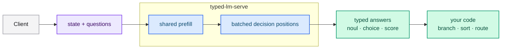
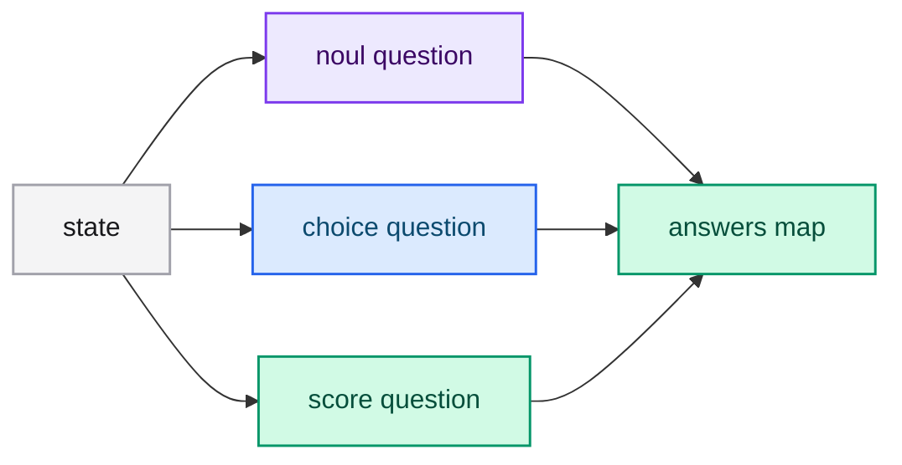
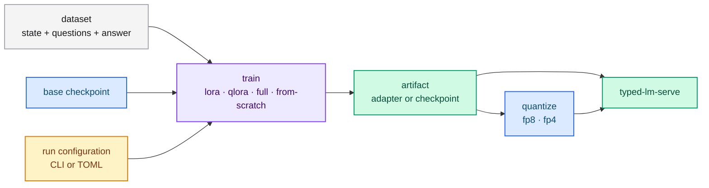
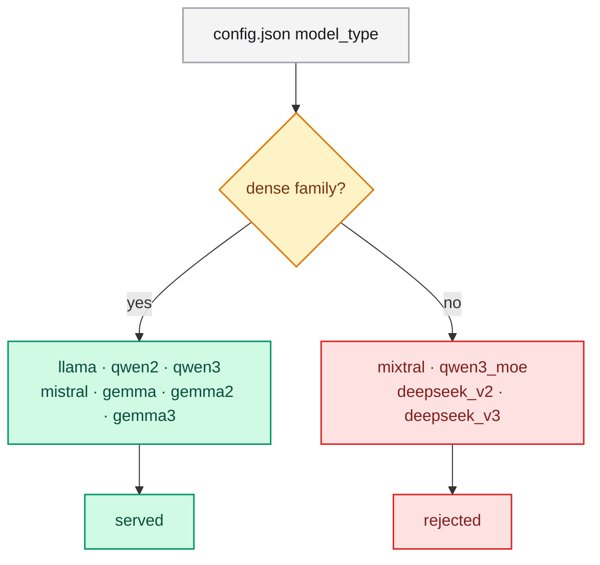
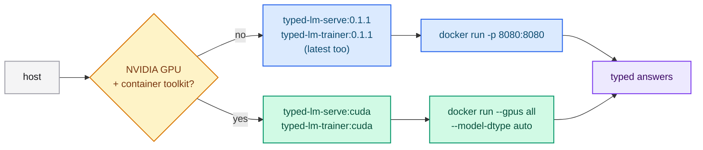

<div align="center">

# typed-lm

`Deterministic inference · Adapter training · Apache-2.0`

### Structured decisions in a single forward pass.

**typed-lm** turns dense decoder models — Llama, Qwen2, Qwen3, Mistral, Gemma,
Gemma2 and Gemma3 — into a typed semantic-routing API. Send a *state* and typed
*questions*; receive booleans, choices and scores your code can branch on. No
text generation, no parsing.

[](https://github.com/neurono-ml/typed-lm)
[](https://neurono-ml.github.io/typed-lm/quickstart.html)
[](https://neurono-ml.github.io/typed-lm/guides/api.html)

| **7** | **3** | **4** | **1** |
|:---:|:---:|:---:|:---:|
| dense model families | question primitives | training methods | forward pass per request |

[](https://neurono-ml.github.io/typed-lm/)
[](https://github.com/neurono-ml/typed-lm/actions/workflows/ci.yml)
[](https://crates.io/crates/typed-lm-serve)
[](https://docs.rs/typed-lm-serve)
[](https://crates.io/crates/typed-lm-serve)
[](./LICENSE)
[](https://www.rust-lang.org/)

</div>

## Performance

One forward pass means **milliseconds, not seconds**. On a single RTX 3070 with
F16 weights, a full request — the shared prefill plus five batched question
suffixes — is answered in tens to hundreds of milliseconds.

**GPU** (release, Qwen2.5-1.5B, `F16`, RTX 3070):

| Prefix | prefill | 5 batched suffixes | single next token |
|---|---|---|---|
| 64 | **14 ms** | **36 ms** | **52 ms** |
| 256 | **31 ms** | **81 ms** | **65 ms** |
| 1024 | **154 ms** | **379 ms** | **64 ms** |

Adding a question adds a suffix to the same batched pass, not a new request, so
latency grows with the prefix length — not with the number of questions.

<details>
<summary><strong>CPU numbers</strong> (release, dense <code>F32</code>)</summary>

| Prefix | Stage | Baseline | + CPU flash | + MKL |
|---|---|---|---|---|
| 64 | prefill | 3.13 s | 2.34 s | **0.52 s** |
| 256 | prefill | 8.65 s | 4.97 s | **1.69 s** |
| 1024 | prefill | 28.23 s | 20.66 s | **13.13 s** |
| 64 | 5 batched suffixes | 1.44 s | 1.33 s | **0.25 s** |
| 256 | 5 batched suffixes | 2.47 s | 1.98 s | **0.35 s** |
| 1024 | 5 batched suffixes | 4.74 s | 4.59 s | **2.57 s** |

The recommended CPU mode is a GGUF `Q4_K_M` checkpoint with the `mkl` feature.

</details>

The session prefix cache skips the prefill entirely for repeated states. More in
[benchmarks](https://neurono-ml.github.io/typed-lm/engineering/benchmarks.html).

## The idea

A large language model answers by generating text token by token. When your
software needs a judgment it can branch on, that creates a mismatch: you prompt,
you parse, you validate — and you still get a string. **typed-lm** removes the
mismatch. It runs the model **once**, reads the logits at a single **decision
position**, and returns a typed value with a calibrated distribution.



### Why it works

<table>
<tr>
<td width="50%" valign="top">

**⚡ One forward pass per request**

All questions share a prefill and are evaluated in one batched pass. Adding
questions barely changes latency.

**🎯 Calibrated by training**

LoRA, QLoRA and full training optimize the exact decision-position loss the
server reads at inference.

</td>
<td width="50%" valign="top">

**🧩 Jev-compatible**

Drop-in compatible with the Jev (TypeSafe AI) contract: `noul`, `choice` and
`score`, combinable in one call.

**📦 Servable artifacts**

FP8/FP4 quantization and full/from-scratch checkpoints are served directly by
the same binary.

</td>
</tr>
</table>

## The three primitives

| Question | Goal | Returns |
|---|---|---|
| **Noul** | Is this statement true? | `noul` (0.0 to 1.0) |
| **Choice** | Pick one option from a closed set | `choice`, `probabilities`, `confidence` |
| **Score** | Rate the state on ordered levels | `score`, `legend`, `probabilities`, `confidence` |

All three can be combined in a single request, and each question is evaluated
independently against the same state.



## Train on your own decisions

typed-lm is not just an inference server — it ships a **trainer** that turns a
general-purpose checkpoint into a specialist for *your* decisions. It optimizes
the **cross-entropy at the decision position**, the exact position the server
reads, so what you train is what you serve.

<div align="center">

| **LoRA** | **QLoRA** | **Full** | **From-scratch** |
|:---:|:---:|:---:|:---:|
| adapters over a frozen base | adapters over a quantized base | every parameter | random init, deterministic |

</div>

**Why train with typed-lm?**

- **One objective, end to end** — the training loss is the serving decision, so
  there is no train/serve skew.
- **Cheap specialization** — LoRA/QLoRA store only the adapter tensors; the base
  is never duplicated.
- **Your labels, your thresholds** — confidence is calibrated on your data.
- **Quantize what you train** — FP8/FP4 PTQ and full/from-scratch checkpoints are
  served by the same binary, with no merge step for complete checkpoints.



```bash
# Train a LoRA adapter over a frozen checkpoint.
typed-lm-trainer train \
  --model-id /path/to/local/checkpoint \
  --dataset resources/dataset.jsonl \
  --output-directory output/train \
  --method lora --epochs 3 --batch-size 4 --learning-rate 1e-4

# Merge the adapter and quantize to FP8.
typed-lm-trainer quantize \
  --model-id /path/to/local/checkpoint \
  --adapter-directory output/train \
  --quantization fp8 --output-directory output/quantized
```

| `--method` | Trainable parameters | Output | Serve directly? |
|---|---|---|---|
| `lora` (default) | LoRA `A`/`B` over a frozen checkpoint | `adapter.safetensors` | merge first |
| `qlora` | LoRA over a quantized base | `adapter.safetensors` | merge first |
| `full` | Every parameter from a checkpoint | complete checkpoint | **yes** |
| `from-scratch` | Every parameter from random init (deterministic by `--seed`) | complete checkpoint | **yes** |

> Full tutorial: [training](https://neurono-ml.github.io/typed-lm/training/index.html).

## Quickstart

### With Docker (recommended)

The fastest path — no toolchain, just an image. The server image pulls the model
on first startup and listens on `8080`:

```bash
# Server. Pass an HF_TOKEN for gated models and mount a context file if you have one.
docker run --rm -p 8080:8080 \
  -e HF_TOKEN=<hugging-face-token> \
  -v "$PWD/resources/memory.md:/etc/typed-lm/memory.md:ro" \
  -e CONTEXT_PATH=/etc/typed-lm/memory.md \
  ghcr.io/neurono-ml/typed-lm-serve:0.1.1

# Ask three typed questions in one call.
curl -s http://127.0.0.1:8080/v1/systemone \
  -H 'Content-Type: application/json' \
  -d @examples/request_mixed.json
```

The trainer runs the same way, with the artifacts directory mounted so the
outputs survive the container:

```bash
# Train a LoRA adapter; /work holds the checkpoint, dataset and outputs.
docker run --rm -v "$PWD:/work" -w /work \
  -e HF_TOKEN=<hugging-face-token> \
  ghcr.io/neurono-ml/typed-lm-trainer:0.1.1 train \
  --model-id /work/checkpoint \
  --dataset /work/resources/dataset.jsonl \
  --output-directory /work/output/train \
  --method lora --epochs 3 --batch-size 4 --learning-rate 1e-4
```

For a GPU, use the `:cuda` image (it includes the CUDA runtime libraries) and
pass `--gpus all`; the host only needs the NVIDIA driver and the container
toolkit:

```bash
# Server on GPU.
docker run --rm --gpus all -p 8080:8080 \
  -e HF_TOKEN=<hugging-face-token> \
  ghcr.io/neurono-ml/typed-lm-serve:cuda

# Trainer on GPU.
docker run --rm --gpus all -v "$PWD:/work" -w /work \
  -e HF_TOKEN=<hugging-face-token> \
  ghcr.io/neurono-ml/typed-lm-trainer:cuda train \
  --model-id /work/checkpoint \
  --dataset /work/resources/dataset.jsonl \
  --output-directory /work/output/train \
  --method lora --device cuda --epochs 3 --batch-size 4 --learning-rate 1e-4
```

### With cargo

```bash
# Install (CPU build; add --features cuda or --features metal for a GPU).
cargo install typed-lm-serve typed-lm-trainer

# Start the server (downloads the default model on first startup).
typed-lm-serve --context-path resources/memory.md

# Ask three typed questions in one call.
curl -s http://127.0.0.1:8080/v1/systemone \
  -H 'Content-Type: application/json' \
  -d @examples/request_mixed.json
```

**Request**

```json
{
  "model": "typed-lm",
  "state": "Order #7710 arrived with a smashed box and a cracked vase inside. Delivery was 3 days ago and the customer asks what to do next.",
  "questions": {
    "refund_eligible": {
      "type": "noul",
      "instructions": "The customer is eligible for a full refund under the store policy."
    },
    "responsible_department": {
      "type": "choice",
      "instructions": "Which department should handle this case?",
      "criteria": {
        "billing": "Double charges and payment errors",
        "logistics": "Damaged, lost, or late shipments",
        "product_support": "Defective-item troubleshooting, replacements, and setup help"
      }
    },
    "urgency": {
      "type": "score",
      "instructions": "How urgent is this case?",
      "criteria": ["Routine", "Urgent", "Emergency"]
    }
  }
}
```

**Response**

```json
{
  "model": "typed-lm",
  "answers": {
    "refund_eligible": { "type": "noul", "noul": 0.87 },
    "responsible_department": {
      "type": "choice",
      "choice": "logistics",
      "probabilities": { "billing": 0.05, "logistics": 0.9, "product_support": 0.05 },
      "confidence": 0.85
    },
    "urgency": {
      "type": "score",
      "score": 1.2,
      "legend": { "0": "Routine", "1": "Urgent", "2": "Emergency" },
      "probabilities": { "0": 0.2, "1": 0.4, "2": 0.4 },
      "confidence": 0.2
    }
  },
  "usage": { "input_tokens": 512, "output_tokens": 4 }
}
```

> Full walkthrough: [quickstart](https://neurono-ml.github.io/typed-lm/quickstart.html).
## Supported architectures

Detected automatically from `model_type` in `config.json`.



Dense safetensors, PyTorch (`.pth`/`.bin`) and NumPy (`.npz`) checkpoints of any
of the seven families are served. **GGUF-quantized serving is Qwen2-only.**
Mixture-of-Experts and multi-head-latent-attention families are rejected at load
time. FP8 and FP4 artifacts are dequantized on load; `GPTQ`/`AWQ` are rejected.

## Workspace

| Crate | Role | Type |
|---|---|---|
| [`typed-lm-common`](typed-lm-common/README.md) | Jev contract, labels, prompt rendering, checkpoint detection, device/dtype, quantization | lib |
| [`typed-lm-serve`](typed-lm-serve/README.md) | Jev-compatible Actix server (binary, no subcommand) | bin |
| [`typed-lm-trainer`](typed-lm-trainer/README.md) | LoRA/QLoRA/full/from-scratch training and FP8/FP4 PTQ | bin + lib |

```bash
cargo build --workspace
cargo run -p typed-lm-serve -- --help
cargo run -p typed-lm-trainer -- --help
```

## Installation

### From crates.io

| Variant | Server | Trainer | Requirements |
|---|---|---|---|
| **CPU** (default) | `cargo install typed-lm-serve` | `cargo install typed-lm-trainer` | A Rust toolchain. Add `--features mkl` for Intel MKL BLAS on x86. |
| **CUDA** | `--features cuda` | `--features cuda` | The CUDA toolkit (`nvcc`) and an NVIDIA driver. |
| **Apple GPU (Metal)** | `--features metal` | `--features metal` | macOS on Apple Silicon. |

### Container images

Prebuilt images for both binaries are published to the GitHub Container Registry
on every release. CPU images carry `latest` and the version; CUDA images add a
`-cuda` suffix (and the `cuda` tag):



```bash
# CPU
docker pull ghcr.io/neurono-ml/typed-lm-serve:latest
docker pull ghcr.io/neurono-ml/typed-lm-serve:0.1.1

# CUDA (GPU)
docker pull ghcr.io/neurono-ml/typed-lm-serve:cuda
docker pull ghcr.io/neurono-ml/typed-lm-serve:0.1.1-cuda
```

| Image | Accelerator | Contents |
|---|---|---|
| `ghcr.io/neurono-ml/typed-lm-serve` | CPU | The Jev-compatible HTTP server |
| `ghcr.io/neurono-ml/typed-lm-trainer` | CPU | `train` and `quantize` |
| `.../typed-lm-serve:cuda` | CUDA | Server with the CUDA runtime libraries |
| `.../typed-lm-trainer:cuda` | CUDA | Trainer with the CUDA runtime libraries |

The server listens on `8080`; pass an `HF_TOKEN` for gated models, and mount a
context file and the model cache:

```bash
docker run --rm -p 8080:8080 \
  -e HF_TOKEN=<hugging-face-token> \
  -v typed-lm-cache:/root/.cache/huggingface \
  -v "$PWD/resources/memory.md:/etc/typed-lm/memory.md:ro" \
  -e CONTEXT_PATH=/etc/typed-lm/memory.md \
  ghcr.io/neurono-ml/typed-lm-serve:0.1.1
```

#### GPU (CUDA)

The CUDA images bundle the runtime libraries candle loads (`cudart`, `cublas`,
`curand`, `nvrtc`); the host only needs the NVIDIA driver and the container
toolkit. Select F16 weights automatically with `--model-dtype auto`:

```bash
docker run --rm --gpus all -p 8080:8080 \
  -e HF_TOKEN=<hugging-face-token> \
  -e MODEL_DTYPE=auto \
  -v typed-lm-cache:/root/.cache/huggingface \
  ghcr.io/neurono-ml/typed-lm-serve:cuda
```

To build the CUDA image from source instead (the release pipeline does this
automatically), use the multi-stage Dockerfile; the compute capability can be
tuned for the target GPU:

```bash
docker build -f docker/Dockerfile.serve-cuda \
  --build-arg CUDA_COMPUTE_CAP=80 -t typed-lm-serve:cuda .
```

### Prebuilt binaries

Each [release](https://github.com/neurono-ml/typed-lm/releases) attaches binaries
for Linux x86_64 (CPU/CUDA) and macOS arm64 (Metal):

<details>
<summary><strong>Server flags (defaults)</strong></summary>

| Flag | Env | Default |
|---|---|---|
| `--host` | `HOST` | `0.0.0.0` |
| `--port` | `PORT` | `8080` |
| `--model-id` | `MODEL_ID` | `Qwen/Qwen2.5-1.5B-Instruct` |
| `--context-path` | `CONTEXT_PATH` | empty |
| `--served-model-name` | `SERVED_MODEL_NAME` | `typed-lm` |
| `--model-dtype` | `MODEL_DTYPE` | `auto` |
| `--session-cache-entries` | `SESSION_CACHE_ENTRIES` | `16` |
| `--session-cache-tokens` | `SESSION_CACHE_TOKENS` | `32768` |

Full reference: [server flags](https://neurono-ml.github.io/typed-lm/reference/server-flags.html).

</details>

## Performance details

Full CPU and GPU latency tables, the acceleration features and the session-cache
gain are in [benchmarks](https://neurono-ml.github.io/typed-lm/engineering/benchmarks.html).

## Routes

`POST /v1/systemone`, `GET /v1/models`, `GET /health`, `GET /health/live`.
Invalid bodies return `422`, unknown models `404`, inference failures `500`, all
with the `{"error": {"message": "..."}}` envelope.

## Testing

```bash
cargo test --workspace                            # unit + integration, no download
cargo test --workspace -- --ignored --nocapture   # live tests (real weights)
cargo clippy --workspace --all-targets
cargo fmt --check
```

`cargo test --workspace` includes a weight-free **binary E2E**
(`train` → `quantize` → `serve` over HTTP). Live tests marked `#[ignore]` need
real weights and a GPU for the training cases; they never run in CI.

## Documentation

The complete guide is published at **<https://neurono-ml.github.io/typed-lm/>**:

| Guide | Link |
|---|---|
| Quick start | <https://neurono-ml.github.io/typed-lm/quickstart.html> |
| Calling the API | <https://neurono-ml.github.io/typed-lm/guides/api.html> |
| Running the server | <https://neurono-ml.github.io/typed-lm/guides/running.html> |
| Training tutorial | <https://neurono-ml.github.io/typed-lm/training/index.html> |
| Configuration file (TOML) | <https://neurono-ml.github.io/typed-lm/reference/configuration-file.html> |
| CLI cheat sheet | <https://neurono-ml.github.io/typed-lm/reference/cheatsheet.html> |

For AI assistants, the site exposes an index at
<https://neurono-ml.github.io/typed-lm/llms.txt>.

## Contributing

Contributions are welcome — code, docs, datasets and prompts alike. The project
rules live in [`AGENTS.md`](AGENTS.md).

```bash
cargo fmt --all --check
cargo clippy --workspace --all-targets -- -D warnings
cargo test --workspace
```

## License

Apache-2.0. See [LICENSE](./LICENSE).
