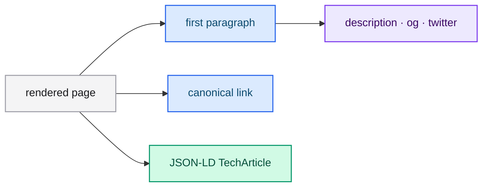

# Search and AI indexing

This documentation is built to be read by people and by search engines and
generative assistants. This page explains the mechanisms so contributors keep them
working.

## What is in place

| Mechanism | File | Purpose |
|---|---|---|
| Full-text search | mdBook search index | In-browser search with title and hierarchy boosts |
| Canonical URLs | `site-url` in `book.toml` | One canonical address per page |
| `llms.txt` | `docs/src/llms.txt` | A curated index of the most useful pages for LLMs |
| `robots.txt` | `docs/src/robots.txt` | Explicitly allows major AI crawlers |
| `sitemap.xml` | generated in CI | A complete list of pages |
| Meta tags | `custom.js` | Description, Open Graph, Twitter, canonical |
| Structured data | `custom.js` | JSON-LD `TechArticle` per page |

## How the metadata is produced

mdBook does not emit per-page descriptions. The `custom.js` script reads the first
paragraph of the page and injects the SEO and generative-engine metadata at
runtime.

## Writing for discovery

- **Start every page with a self-contained summary paragraph.** It becomes the
  description and the snippet.
- **Phrase headings as questions** when they answer one ("How do I train a LoRA
  adapter?").
- **Keep parameter tables complete**, including defaults.
- **Describe every diagram** with `accTitle` and `accDescr` so its content is
  available without the image.
- **Use language-tagged code blocks** so snippets are extracted correctly.
- **Prefer concrete terms** — route names, flags, field names — over synonyms.

## Diagrams and accessibility

Mermaid diagrams are rendered client-side into SVG with `role="img"` and an
`aria-label` derived from `accTitle`/`accDescr`. Always include both directives.

## Keeping `llms.txt` current

When you add a high-value page, add it to `docs/src/llms.txt` with a one-line
description. Keep the list focused on the pages an assistant should read first.

## Next steps

- [Contributing](./contributing.md) — the project rules.
- [FAQ](./faq.md) — common questions.
