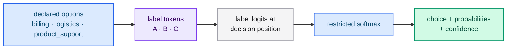

# Choice

A **Choice** question selects one option from a closed, declared set. Use it for
routing, classification and any decision where the answer must be one of a known
list.

## When should I use Choice?

- Routing a request to a department, team or handler.
- Classifying a document into a taxonomy.
- Selecting one of several candidate functions or skills.
- Picking the best passage from a shortlist.

If the decision is boolean, prefer [Noul](./noul.md). If it is an ordered
intensity, prefer [Score](./score.md).

## Request shape

```json
{
  "type": "choice",
  "instructions": "Which department should handle this case?",
  "criteria": {
    "billing": "Double charges and payment errors",
    "logistics": "Damaged, lost, or late shipments",
    "product_support": "Defective-item troubleshooting, replacements, and setup help"
  }
}
```

- `criteria` is **required** and is an object mapping each option name to a
  description. The description may be `null` when no description is needed.

## Response shape

```json
{
  "type": "choice",
  "choice": "logistics",
  "probabilities": { "billing": 0.05, "logistics": 0.9, "product_support": 0.05 },
  "confidence": 0.85
}
```

- `choice` — the option with the highest restricted-softmax probability.
- `probabilities` — the full distribution over the declared options.
- `confidence` — how concentrated the distribution is (see
  [Confidence](./confidence.md)).

## How is it scored?

The options are ordered lexicographically by name and mapped to the spreadsheet
labels `A`, `B`, `C`, … . The model reads those label logits at the decision
position and applies a temperature-scaled softmax over them.



## Best practices

- **Make options mutually exclusive.** Overlapping options split the probability
  and reduce confidence.
- **Give every option a description** when the name alone is ambiguous.
- **Keep the set small.** A handful of focused options is more reliable than
  dozens of near-synonyms. For large taxonomies, use a hierarchy of choices.
- **Do not add a catch-all** unless "other" is a real business outcome; it invites
  the model to avoid a decision.

## Scripting it

```bash
curl -s http://127.0.0.1:8080/v1/systemone \
  -H 'Content-Type: application/json' \
  -d @examples/request_mixed.json
```

## Next steps

- [Score](./score.md) and [Noul](./noul.md) — the other primitives.
- [Confidence](./confidence.md) — act only when the model is sure.
- [Intent routing](../guides/patterns/intent-routing.md) — a Choice pattern.
