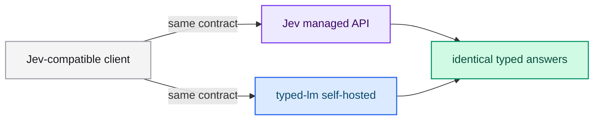

# typed-lm and Jev

typed-lm implements the **Jev** (TypeSafe AI) HTTP contract so an existing Jev
client can point at a self-hosted model running on your own hardware. This page
summarizes what is compatible and where the projects differ.

## What is Jev?

Jev is TypeSafe's flagship *System One* model. It evaluates typed questions
against a state and returns structured answers. typed-lm follows the same idea:
no free-text generation, only typed results extracted from a single forward pass.

## Compatibility table

| Aspect | Jev | typed-lm |
|---|---|---|
| Main route | `POST /v1/systemone` | `POST /v1/systemone` |
| Question types | `noul`, `choice`, `score` | `noul`, `choice`, `score` |
| Combine types in one call | Yes | Yes |
| `choice` answer | `choice`, `probabilities`, `confidence` | `choice`, `probabilities`, `confidence` |
| `score` answer | `score`, `legend`, `probabilities`, `confidence` | `score`, `legend`, `probabilities`, `confidence` |
| `noul` answer | `noul` (0.0 to 1.0) | `noul` (0.0 to 1.0) |
| Model listing | `GET /v1/models` | `GET /v1/models` |
| Health | `GET /health` | `GET /health`, `GET /health/live` |
| Hosting | Managed API | Self-hosted, open source |
| Model | Jev | Any supported dense family |

## Where they differ

- **Hosting.** Jev is a managed service; typed-lm runs on your hardware and
  exposes the contract locally.
- **Model choice.** typed-lm serves dense decoder checkpoints you supply —
  Llama, Qwen2, Qwen3, Mistral, Gemma, Gemma2 and Gemma3 — plus adapters and
  quantized artifacts produced by its own trainer.
- **Training.** typed-lm ships a trainer so you can fine-tune the exact
  decision-position behavior the API uses.

## When should I use which?

- **Use Jev** when you want a managed, always-up-to-date model with no operations.
- **Use typed-lm** when you need self-hosting, a specific open model, local data
  residency, or a model fine-tuned on your own decisions.

## Next steps

- [Calling the API](../guides/api.md) — the exact contract.
- [Running the server](../guides/running.md) — stand up a self-hosted endpoint.
- [Training overview](../training/index.md) — specialize the model.
