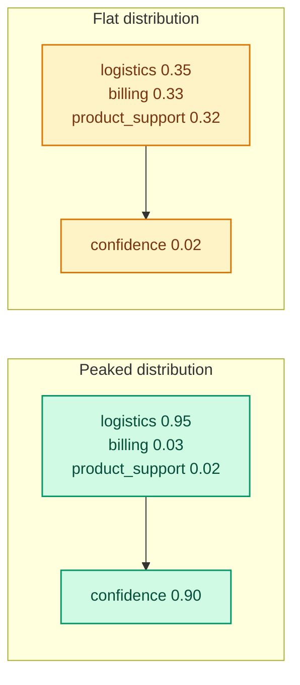
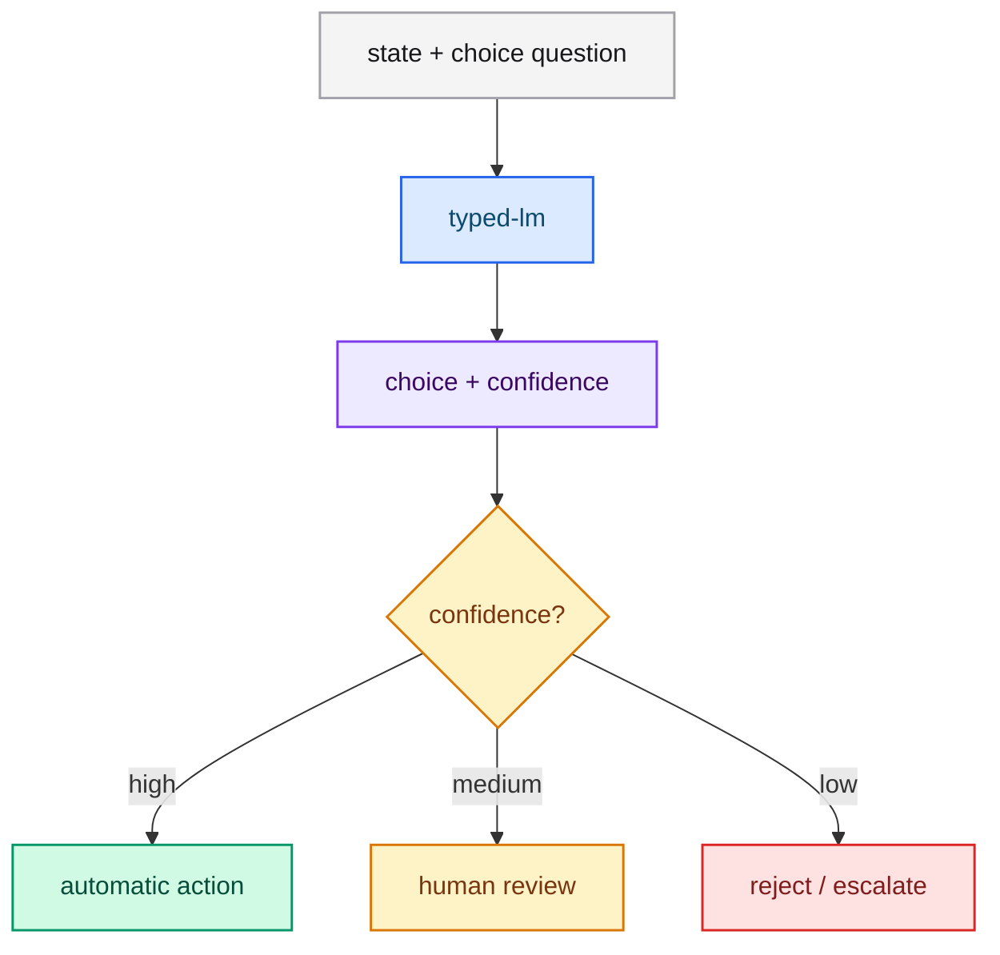

# Confidence

**Confidence** tells your code how certain the model is about a `choice` or
`score` answer. It is a second axis: the answer says *what*, confidence says
*whether to act on it*.

## Which answers carry confidence?

- `choice` — returns `confidence` alongside `choice` and `probabilities`.
- `score` — returns `confidence` alongside `score`, `legend` and `probabilities`.
- `noul` — does not return a separate confidence; the `noul` value is itself the
  calibrated affirmative probability.

## How is confidence defined?

Confidence is derived from how concentrated the restricted distribution is. A
distribution with one dominant option is confident; a flat distribution is not.
A perfectly uniform distribution over two options is the least confident case.

## Why does confidence matter?

High accuracy overall can still hide unreliable individual answers. Confidence
lets you separate the two:

- **Answer** — the best option or the expected score.
- **Confidence** — whether that answer is trustworthy enough to automate.

A common pattern is a three-way decision: act automatically above a high
threshold, review in a middle band, and reject or escalate below a low one.

## How do I use it architecturally?

## Calibration

Confidence is only useful if it is calibrated by training. Because the trainer
optimizes the same decision-position cross-entropy the server reads, the
distribution you see at inference is the one the model was tuned to produce. See
[Training overview](../training/index.md).

## Best practices

- **Do not hardcode one threshold for everything.** Different questions have
  different error costs.
- **Measure on your data.** Pick thresholds from a held-out set, not by intuition.
- **Keep the raw distribution.** Even when you act automatically, log
  `probabilities` so you can audit and recalibrate later.
- **Prefer more specific questions.** A vague question produces a flat
  distribution; a focused one produces a confident answer.

## Next steps

- [Patterns](../guides/patterns.md) — confidence-gated routing and more.
- [Choice](./choice.md) and [Score](./score.md) — where confidence appears.
- [Training overview](../training/index.md) — how calibration is produced.
