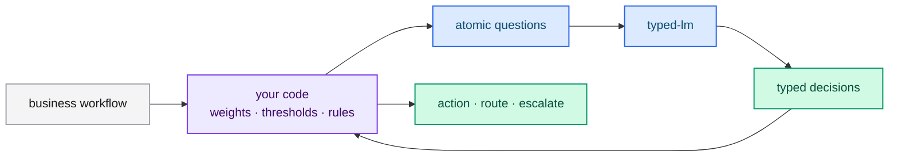

# Designing with typed decisions

typed-lm works best when you keep the **control** in your code and give the model
**narrow, structured decisions**. This chapter is a short design guide.

## Keep code in control

The model answers questions; your code decides what to do with the answers. Do
not ask the model to perform multi-step reasoning or to choose a whole workflow.
Ask for the individual judgments, then combine them with ordinary logic.

## Decompose, do not compound

A compound question forces the model to weigh several factors at once, which
reduces reliability. Decompose it into atomic questions and combine the results in
code.

Instead of *"rate this startup pitch"*, ask separately about market size,
technical feasibility and differentiation. Combine the scores with your own
formula, so priorities can change without rewriting a prompt.

## Ask one thing per question

- **Specific** — "The customer is eligible for a full refund under the store
  policy." is better than "assess this case."
- **Closed** — the answer set is declared in `criteria`.
- **Grounded** — the facts it needs are in the state or the context.

## Match the primitive to the decision

| Decision | Primitive |
|---|---|
| True / false | [Noul](./noul.md) |
| One of a known set | [Choice](./choice.md) |
| Ordered intensity | [Score](./score.md) |

## Use confidence to decide whether to act

Treat `confidence` (for choice and score) and the `noul` value as gates. Act
automatically only when the model is sure; route the uncertain band to a human or
a slower path. See [Confidence](./confidence.md).

## A worked decomposition

A support ticket must be refunded, routed and prioritized. Do not ask one
question that returns all three. Ask three:

1. **Noul** — is the customer eligible for a full refund?
2. **Choice** — which department owns this case?
3. **Score** — how urgent is it?

Then combine in code: refund only when the noul exceeds your threshold *and* the
amount is within policy; route to the chosen department; escalate when urgency is
high. Every rule lives in code, where you can test and change it.

## Next steps

- [Patterns](../guides/patterns.md) — reusable architectures.
- [Cookbooks](../guides/cookbooks.md) — end-to-end examples.
- [Preparing datasets](../training/datasets.md) — teach these decisions.
