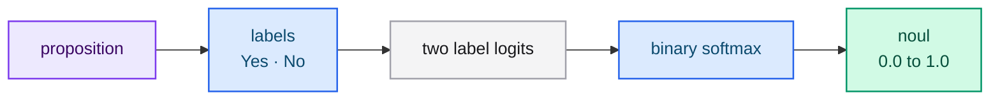
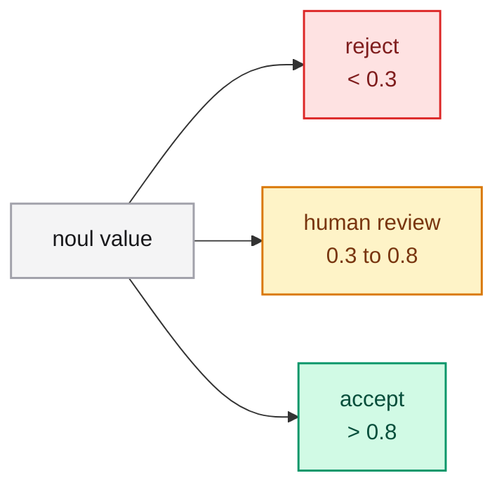

# Noul

A **Noul** question asks whether a proposition is true and returns the
probability that the answer is *yes*. Use it for boolean decisions.

## When should I use Noul?

- The customer is eligible for a full refund.
- This message contains a payment error.
- The document answers the question.
- The passage supports the claim.

Noul is the right primitive whenever the outcome is a yes/no determination.

## Request shape

```json
{
  "type": "noul",
  "instructions": "The customer is eligible for a full refund under the store policy."
}
```

- `instructions` states the proposition to evaluate.
- `criteria` is optional and lets you rename the two labels.

Custom labels:

```json
{
  "type": "noul",
  "instructions": "The request is approved.",
  "criteria": { "yes": "Approved", "no": "Rejected" }
}
```

## Response shape

```json
{
  "type": "noul",
  "noul": 0.87
}
```

- `noul` — the probability of the affirmative answer, between `0.0` and `1.0`.

Noul does not return `probabilities` or `confidence`; the single value is already
the calibrated affirmative probability.

## How is it scored?

The proposition is rendered with two labels (`Yes`/`No` by default, or the custom
labels). The model reads those two label logits at the decision position and
applies a binary softmax.



## How do I use the value?

`noul` is a probability, not a hard label. Decide the threshold in your code:

- `> 0.5` — affirmative.
- A stricter threshold such as `> 0.8` — affirmative only when the model is
  confident.
- The uncertain band in between — route to a human or a slower path.



## Best practices

- **State the proposition as a fact**, not as a question: "The customer is
  eligible…" rather than "Is the customer eligible?".
- **Ask one thing.** If a proposition hides two conditions, split it into two
  nouls and combine them in code.
- **Anchor the policy in the state or context** so the model has the rule it must
  apply.

## Next steps

- [Choice](./choice.md) and [Score](./score.md) — the other primitives.
- [Confidence-gated routing](../guides/patterns/confidence-routing.md) — acting on certainty.
- [State](./state.md) — giving the model the facts it needs.
