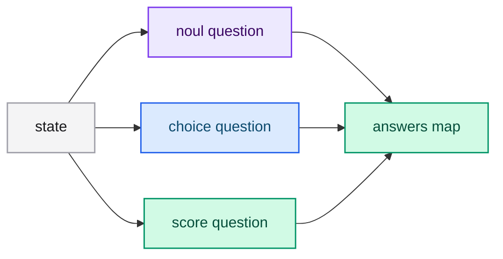

# Questions (primitives)

A **question** describes the judgment you want on a state. typed-lm has three
question types — *primitives* — each returning a different typed answer. All three
can be combined in a single request.

| Question type | Goal | Returns |
|---|---|---|
| [Choice](./choice.md) | Choose an option from a list | `choice`, `probabilities`, `confidence` |
| [Score](./score.md) | Score the state on a rubric | `score`, `legend`, `probabilities`, `confidence` |
| [Noul](./noul.md) | Is this statement true? | `noul` (0.0 to 1.0) |

## How do I choose between them?

- Use **Noul** for boolean decisions: *is this eligible?*, *does this contain a
  payment error?*, *is this safe?*
- Use **Choice** for routing and classification into a closed set: *which
  department?*, *which language?*, *which category?*
- Use **Score** for ordered intensity: *how urgent?*, *how relevant?*, *how
  severe?*

## Can I ask several at once?

Yes. `questions` is a map, and every question is evaluated independently against
the same state in one batched forward pass.

```json
{
  "questions": {
    "refund_eligible": {
      "type": "noul",
      "instructions": "The customer is eligible for a full refund under the store policy."
    },
    "responsible_department": {
      "type": "choice",
      "instructions": "Which department should handle this case?",
      "criteria": {
        "billing": "Double charges and payment errors",
        "logistics": "Damaged, lost, or late shipments",
        "product_support": "Defective-item troubleshooting, replacements, and setup help"
      }
    },
    "urgency": {
      "type": "score",
      "instructions": "How urgent is this case?",
      "criteria": ["Routine", "Urgent", "Emergency"]
    }
  }
}
```



## Common fields

Every question carries:

- `type` — `noul`, `choice` or `score`.
- `instructions` — what the model must decide, stated as a proposition or a
  question. It may be a string or any JSON value.
- `criteria` — the label set, whose shape depends on the type.

## Rules and limits

- `questions` must not be empty.
- `choice` requires at least one criterion.
- `score` requires between 2 and 10 levels, in increasing order.
- `noul` always has a yes/no decision; the labels are optional.

## Consistency with training

The trainer uses the same question shapes plus an `answer` field, so a dataset
mirrors the serving contract. See
[Preparing datasets](../training/datasets.md).

## Next steps

- [Choice](./choice.md), [Score](./score.md), [Noul](./noul.md) — the details.
- [Confidence](./confidence.md) — how certain the model is.
- [Calling the API](../guides/api.md) — the full request and response shapes.
