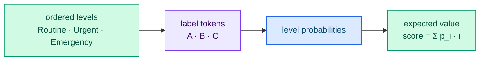

# Score

A **Score** question rates the state on an ordered rubric. Use it for intensity,
severity, relevance and priority — any judgment that lives on a scale rather than
in a category.

## When should I use Score?

- How urgent is this case?
- How relevant is this passage to the query?
- How severe is this policy violation?
- How well does this response match the request?

If the decision is a category, use [Choice](./choice.md). If it is a boolean, use
[Noul](./noul.md).

## Request shape

```json
{
  "type": "score",
  "instructions": "How urgent is this case?",
  "criteria": ["Routine", "Urgent", "Emergency"]
}
```

- `criteria` is **required** and is an array of **2 to 10** level names, listed in
  **increasing** order.

## Response shape

```json
{
  "type": "score",
  "score": 1.2,
  "legend": { "0": "Routine", "1": "Urgent", "2": "Emergency" },
  "probabilities": { "0": 0.2, "1": 0.4, "2": 0.4 },
  "confidence": 0.2
}
```

- `score` — the **expected value** over the levels, using their 0-based index.
  In the example above, `0.2*0 + 0.4*1 + 0.4*2 = 1.2`.
- `legend` — maps each level index to its name.
- `probabilities` — the distribution over the levels.
- `confidence` — how concentrated the distribution is (see
  [Confidence](./confidence.md)).

## How is it scored?

The declared levels are mapped in order to the labels `A`, `B`, `C`, … . The
restricted distribution over those labels yields `probabilities`; `score` is the
probability-weighted mean of the level indices.



## Best practices

- **Order levels consistently** from lowest to highest. The expected value depends
  on the order.
- **Use descriptive level names.** "Emergency" is clearer than "Level 3".
- **Keep levels distinct.** Overlapping levels flatten the distribution.
- **Interpret `score` together with `confidence`.** A score of `1.2` from a peaked
  distribution means something different from the same value from a uniform one.

## Scripting it

```json
{
  "urgency": {
    "type": "score",
    "instructions": "How urgent is this case?",
    "criteria": ["Routine", "Urgent", "Emergency"]
  }
}
```

## Next steps

- [Choice](./choice.md) and [Noul](./noul.md) — the other primitives.
- [Composite scoring](../guides/patterns/composite-scoring.md) — combine scores in code.
- [Confidence](./confidence.md) — how certain the model is.
