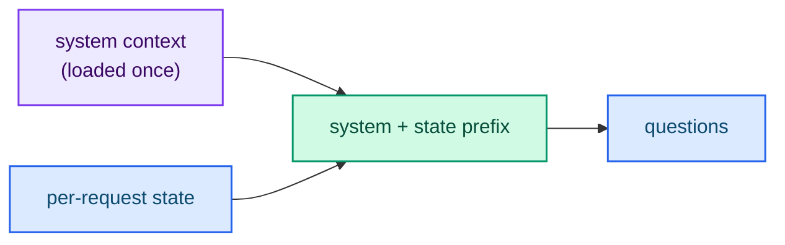

# State

The **state** is the information a question is evaluated against. It is the
"facts of the case": the customer message, the document, the order, the passage.
Every question in a request is evaluated against the same state.

## What can a state be?

The `state` field accepts two forms:

- a **string** of free text, and
- any **JSON value** — an object, an array or a scalar — for structured state.

```json
{
  "model": "typed-lm",
  "state": "Order #7710 arrived with a smashed box and a cracked vase inside.",
  "questions": {
    "refund_eligible": {
      "type": "noul",
      "instructions": "The customer is eligible for a full refund under the store policy."
    }
  }
}
```

Structured state is rendered into the prompt by the shared contract crate, so the
server and the trainer always produce byte-identical prompts.

## State plus context

The server can carry a fixed system context that is prefilled once at startup and
prepended to every request. This is how you anchor answers on a policy, a memory
file or a knowledge base that does not change between requests.

```bash
typed-lm-serve --context-path resources/memory.md
```

The state is then evaluated *together with* the context, as `system + state`.



## The session prefix cache

The expensive part of a request is the forward pass over `system + state`. The
server tokenizes that prefix once and stores the resulting key/value cache in a
bounded LRU, keyed by a canonical hash of the state. When the same state appears
again across requests, that forward pass is skipped.

The cache is bounded by the number of entries (`--session-cache-entries`, default
`16`) and the total cached tokens (`--session-cache-tokens`, default `32768`).
Setting either limit to `0` disables session caching. The retained cache is never
mutated: every request clones it before use.

## How to write a good state

- **Be complete.** Include every fact a question needs; the model does not have
  external knowledge of your domain.
- **Be specific.** Concrete values (amounts, dates, statuses) beat vague prose.
- **Keep it stable.** A state that repeats verbatim across requests benefits from
  the session cache; incidental changes reduce cache hits.
- **Do not embed the answer.** The state describes the case; the question asks
  for the judgment.

## Next steps

- [Questions (primitives)](./primitives.md) — how to ask about the state.
- [Session prefix cache](../engineering/session-cache.md) — the implementation.
- [Running the server](../guides/running.md) — `--context-path` and cache flags.
