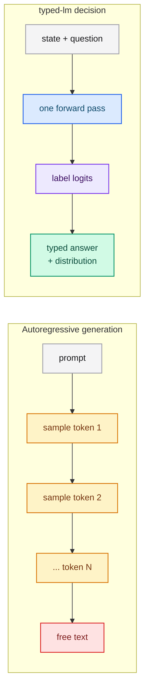
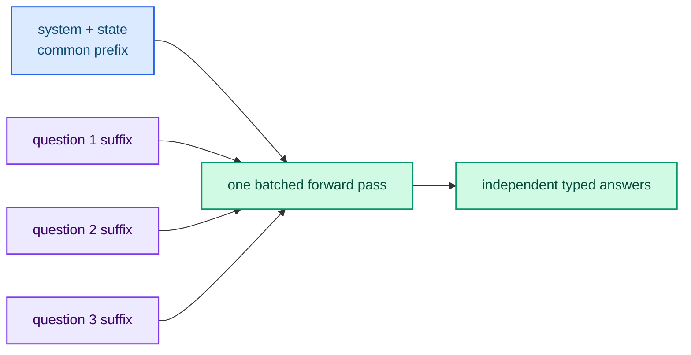

# System One decisions

A traditional language model answers by generating text token by token. The
answer *is* the generation. typed-lm takes a different route: it runs the model
**once**, looks at a single position, and returns a typed decision. This chapter
explains why that matters and how the scoring works.

## Generation versus decision

Text generation and a typed decision optimize different things. Generation must
produce a fluent, long sequence; a decision only needs the next-token
distribution at one position to be calibrated over a small set of labels.

## The decision position

Every question is rendered into a prompt that ends with a small set of candidate
labels. The model reads the logits of those labels at the **last position** — the
decision position — and converts them into a distribution:

- **Noul** applies a binary softmax over the yes/no labels.
- **Choice** applies a restricted softmax over the option labels.
- **Score** applies a temperature-scaled softmax over the ordered levels.

Because the label set is closed, the model can never emit an answer outside it.
There is no parsing step and no hallucinated option.

## One shared prefill, many questions

All questions in a request share the same state. typed-lm tokenizes the common
prefix once, prefills it, and then evaluates each question suffix in a **single
batched forward pass**. Adding a question adds work proportional to the suffix,
not to the whole prompt.

## Atomic questions, composed in code

A System One question works best when it is narrow and self-contained. If a
question would require extended reasoning or mixes several independent factors,
split it. Ask each factor separately and combine the results with logic in your
code. When priorities change, you change a coefficient instead of rewriting a
prompt.

## What this buys you

- **Determinism** — the same state, questions and model produce the same answers.
- **Latency** — one forward pass per request, not one per generated token.
- **Safety** — answers are always inside the declared label set.
- **Calibration** — the returned distribution is what the training optimized.

## Next steps

- [State](./state.md) — what the model evaluates.
- [Questions (primitives)](./primitives.md) — the three question types.
- [Scoring and batched decoding](../engineering/scoring.md) — the implementation.
