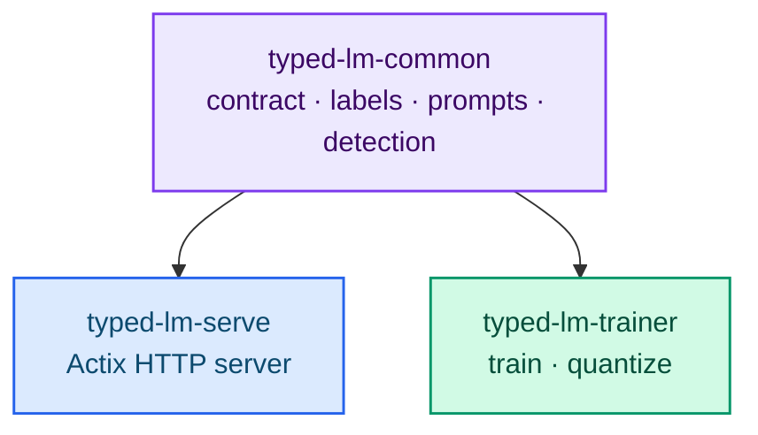
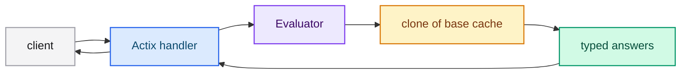

# Architecture

typed-lm is a Rust workspace with three crates. The shared crate defines the
contract the server and the trainer must agree on; the two binaries own HTTP and
training respectively.

## Crates

| Crate | Role | Type |
|---|---|---|
| `typed-lm-common` | Jev contract, labels, prompt rendering, checkpoint and architecture detection, device/dtype policy, quantization, tokenizer | lib |
| `typed-lm-serve` | Jev-compatible Actix server (no subcommand) | bin |
| `typed-lm-trainer` | LoRA/QLoRA/full/from-scratch training and PTQ (subcommands `train`/`quantize`) | bin + lib |

## Module layout

- `typed-lm-common/src/architecture_traits.rs` — per-family dense capabilities
  (attention bias, explicit `head_dim`, sliding window, logit soft-capping, RMSNorm
  offset, embedding scale, local RoPE).
- `typed-lm-serve/src/api/` — response DTOs, errors, routes and handlers.
- `typed-lm-serve/src/domain/` — the `Evaluator`/`MockEvaluator` trait.
- `typed-lm-serve/src/infrastructure/` — Candle: checkpoint loading, tokenizer,
  vendored parallel forward and the real evaluator.
- `typed-lm-serve/src/config/`, `typed-lm-serve/src/bootstrap/` — CLI and startup.
- `typed-lm-trainer/src/{dataset,model,training,quantization}/` — the training and
  PTQ pipeline.
- `typed-lm-trainer/src/configuration_file.rs`,
  `typed-lm-trainer/src/configuration_resolution.rs` — TOML schema and precedence.

## Request path

The model, the tokenizer and the base KV-cache of the system prompt are loaded
once at startup and shared with the Actix workers through `actix_web::web::Data`.
The per-request mutable cache is always a clone of the base cache.

## Context provider

`ContextProvider` is currently `FileContextProvider` (for example
`--context-path resources/memory.md`). The interface allows swapping the source for
retrieval (RAG) later without changing the handlers, the evaluator or the API.

## Next steps

- [Scoring and batched decoding](./scoring.md) — the inference internals.
- [Session prefix cache](./session-cache.md) — the LRU design.
- [Testing](./testing.md) — how the workspace is verified.
