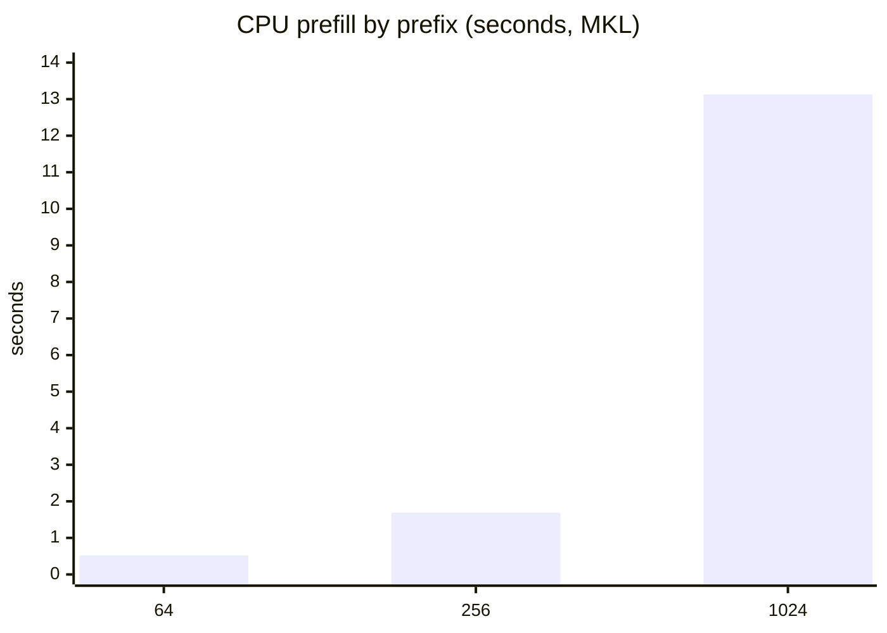

# Benchmarks

These numbers come from the `reports_latency_breakdown` benchmark. They are
indicative; measure on your own hardware.

## CPU

Release, Qwen2.5-1.5B dense, `F32`:

| Prefix | Stage | Baseline | + CPU flash | + MKL |
|---|---|---|---|---|
| 64 | prefill | 3.13 s | 2.34 s | **0.52 s** |
| 256 | prefill | 8.65 s | 4.97 s | **1.69 s** |
| 1024 | prefill | 28.23 s | 20.66 s | **13.13 s** |
| 64 | 5 batched suffixes | 1.44 s | 1.33 s | **0.25 s** |
| 256 | 5 batched suffixes | 2.47 s | 1.98 s | **0.35 s** |
| 1024 | 5 batched suffixes | 4.74 s | 4.59 s | **2.57 s** |
| 64 | single next token | 655 ms | 699 ms | **159 ms** |
| 256 | single next token | 811 ms | 347 ms | **175 ms** |
| 1024 | single next token | 815 ms | 545 ms | **300 ms** |

## GPU

Release, Qwen2.5-1.5B, `F16`, RTX 3070:

| Prefix | prefill | 5 batched suffixes | single next token |
|---|---|---|---|
| 64 | 14 ms | 36 ms | 52 ms |
| 256 | 31 ms | 81 ms | 65 ms |
| 1024 | 154 ms | 379 ms | 64 ms |

## How to read them

- **Prefill** scales with the prefix length; the session cache removes it for
  repeated states.
- **Batched suffixes** are cheap and grow slowly with the number of questions.
- **MKL** is the single biggest CPU win; **CUDA** shifts the whole table to
  milliseconds.

## Reproducing

The benchmark is a test with a latency report. Run it on your machine, keeping the
model and dtype identical.

<strong>GPU runs belong in the devcontainer</strong>, which reserves the GPU and installs
the CUDA toolkit. See <a href="../guides/running.md">Running the server</a>.

## Next steps

- [Scoring and batched decoding](./scoring.md) — why the stages cost what they do.
- [Session prefix cache](./session-cache.md) — removing the prefill cost.
