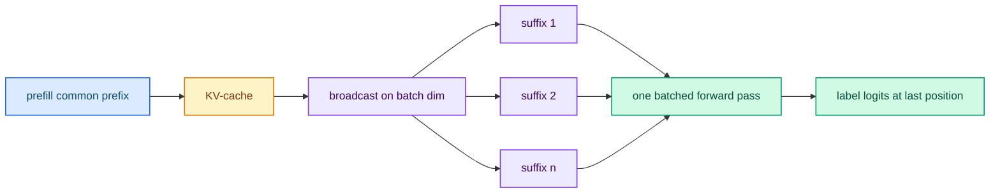

# Scoring and batched decoding

typed-lm reads a decision from one position of one forward pass. This page
describes how the forward pass is organized and how the answers are calibrated.

## Shared prefill and broadcast

The evaluator prefills the fixed system context into a KV-cache once at startup.
Each request then:

1. tokenizes `system + state` and prefills the common prefix;
2. **broadcasts** the cache on the attention batch dimension;
3. evaluates each question suffix in a **single batched forward pass**;
4. reads each label token's logit at the last position.

## Calibration

| Type | Calibration |
|---|---|
| `noul` | Binary softmax over the yes/no labels |
| `choice` | Temperature-scaled restricted softmax over the option labels |
| `score` | Temperature-scaled restricted softmax over the level labels |

`score` is the expected value over the level indices. `confidence` is derived from
how concentrated the distribution is.

## Vendored parallel forward

`typed-lm-serve/src/infrastructure/parallel_llama.rs` is a vendored,
broadcastable dense decoder implementation covering every supported family. It is
validated against upstream by `#[ignore]` equivalence tests.

GGUF-quantized checkpoints use a Qwen2-only path
(`parallel_quantized_qwen2.rs`); any other family served from GGUF is rejected with
an actionable message.

The fused CPU flash attention is used automatically on CPU and keeps GQA grouped.

## Next steps

- [Session prefix cache](./session-cache.md) — skipping the prefix pass.
- [Benchmarks](./benchmarks.md) — measured latency.
- [Architecture](./architecture.md) — the module layout.
