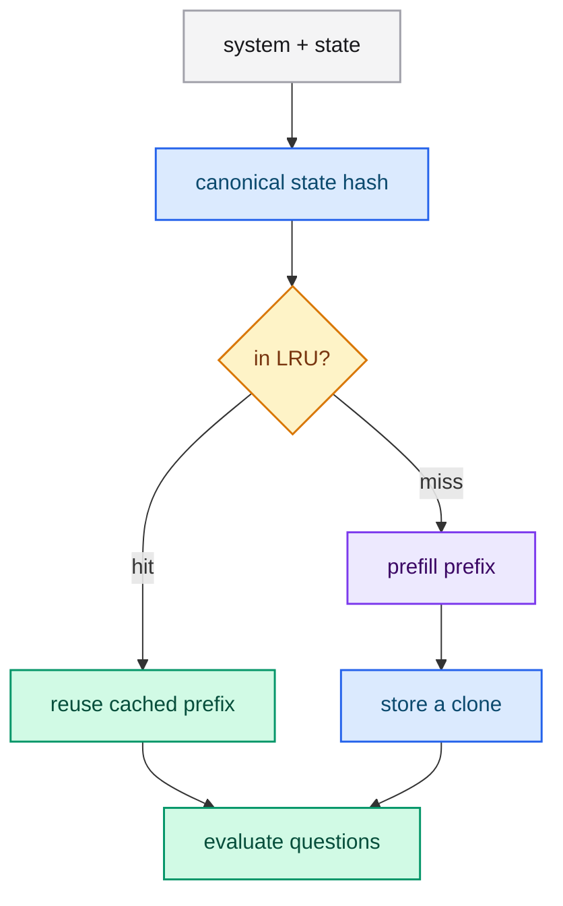

# Session prefix cache

The expensive part of a request is the forward pass over the state prefix
(`system + state`). The session cache keeps that prefill so a repeated state skips
it.

## How it works

The server tokenizes `system + state` once and stores the resulting KV-cache in a
bounded LRU keyed by a **canonical hash of the state**. A state that reappears
across requests is served from the cache.

## Bounds and eviction

The cache is bounded by:

- `--session-cache-entries` (default `16`) — the maximum number of cached prefixes;
- `--session-cache-tokens` (default `32768`) — the maximum total cached tokens.

The least recently used entries are evicted first. Setting either limit to `0`
disables session caching.

## Immutability

The retained cache is **never** mutated. Every request clones it before use, so
concurrent requests cannot corrupt a shared prefix. The same rule applies to the
base cache of the system prompt.

## Sizing advice

- Many repeated states → raise `--session-cache-entries`.
- Long prefixes → raise `--session-cache-tokens`.
- One-off states → set a limit to `0` to save memory.

## Next steps

- [Scoring and batched decoding](./scoring.md) — what is cached.
- [Running the server](../guides/running.md) — the flags.
- [Benchmarks](./benchmarks.md) — the gain.
