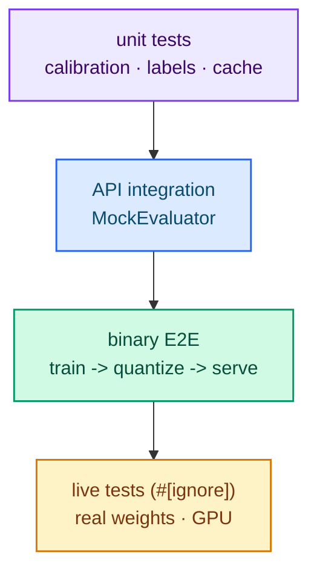

# Testing

The workspace is verified with unit tests, API integration tests, a binary-level
end-to-end test accessible without downloading weights, and live tests that are
marked `#[ignore]`.

## Commands

```bash
cargo test --workspace                            # unit + integration, no download
cargo test --workspace -- --ignored --nocapture   # live tests (real weights)
cargo clippy --workspace --all-targets
cargo fmt --check
```

Do not pass `--all-features` on Linux: the Metal feature requires macOS.

## What runs in CI

`cargo test --workspace` covers:

- probability calibration, labels, prompt rendering and session-cache eviction;
- the CPU flash attention against a matmul/softmax reference (with GQA and causal
  offset);
- FP8/FP4 quantization round-trips;
- dataset discovery and collation, LoRA and the training loop (with dummies);
- API integration with a `MockEvaluator`;
- a **binary-level E2E** (`typed-lm-serve/tests/end_to_end.rs`): `train` →
  `quantize` → `serve` over HTTP, with no weight download.

The network-free ignored tests (`loads_trainer_artifact`) also run in CI.

## Live tests (`#[ignore]`)

`cargo test --workspace -- --ignored` runs the tests that need real weights:

- real-weight equivalence with upstream;
- session-cache gain;
- latency benchmarks;
- FP8/FP4 artifact loading;
- GPU training and quantization (`typed-lm-trainer/tests/live_gpu_e2e.rs`).

Do not run these in CI.



## A reproducible CPU E2E script

A script that runs the CPU end-to-end flow lives in
`temporary/e2e/run_e2e_cpu.sh`.

## Next steps

- [Architecture](./architecture.md) — what is under test.
- [Contributing](../community/contributing.md) — how to submit changes.
