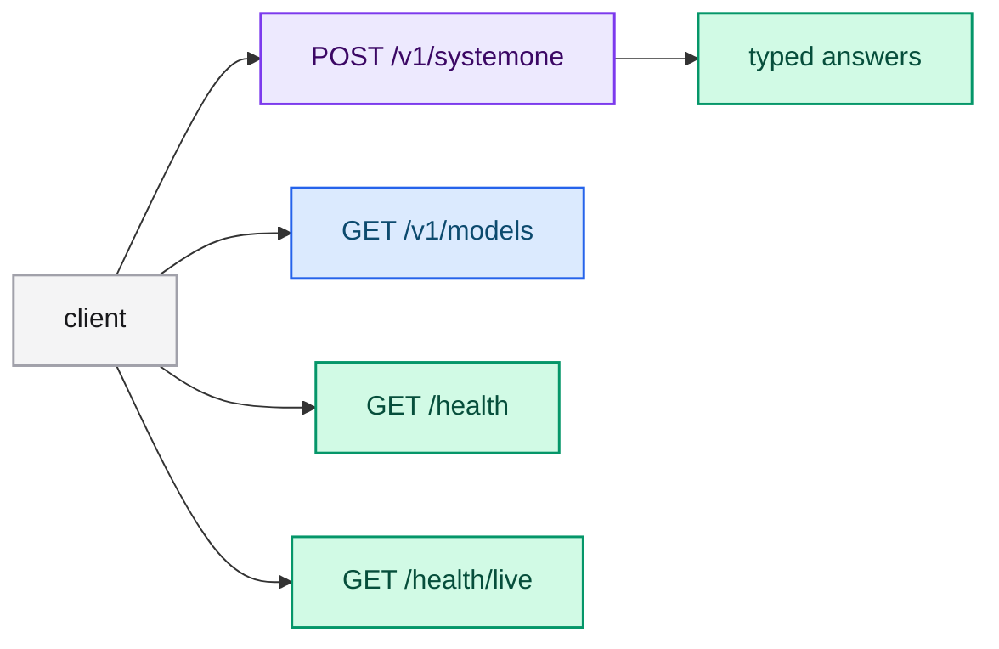

# Calling the API

The server exposes a small Jev-compatible HTTP API. It never generates free text:
every answer is a structured type extracted from the model's logits in a single
forward pass. This guide documents the routes, the request and response contract,
and ready-to-run examples.

Base URL (default): `http://127.0.0.1:8080`.

## Routes

| Method | Path | Purpose |
|---|---|---|
| `POST` | `/v1/systemone` | Evaluate a `state` against one or more typed questions. |
| `GET` | `/v1/models` | List the served model and its `jev-` alias. |
| `GET` | `/health` | Readiness plus the model startup time. |
| `GET` | `/health/live` | Liveness; independent of the model. |



## POST /v1/systemone

The payload carries a `model`, a `state` (the facts of the case) and a map of
`questions`. `noul`, `choice` and `score` questions can be combined in the same
request.

### Request

```json
{
  "model": "jev-latest",
  "state": "Order #7710 arrived with a smashed box and a cracked vase inside. Delivery was 3 days ago and the customer asks what to do next.",
  "questions": {
    "refund_eligible": {
      "type": "noul",
      "instructions": "The customer is eligible for a full refund under the store policy."
    },
    "responsible_department": {
      "type": "choice",
      "instructions": "Which department should handle this case?",
      "criteria": {
        "billing": "Double charges and payment errors",
        "logistics": "Damaged, lost, or late shipments",
        "product_support": "Defective-item troubleshooting, replacements, and setup help"
      }
    },
    "urgency": {
      "type": "score",
      "instructions": "How urgent is this case?",
      "criteria": ["Routine", "Urgent", "Emergency"]
    }
  }
}
```

Field rules:

- `model` — the served model name (see `--served-model-name`) or any alias with
  the `jev-` prefix.
- `state` — free text or a structured JSON value.
- `questions` — must not be empty. `choice` requires at least one criterion;
  `score` requires between 2 and 10 levels; `noul` always has a yes/no decision.

### Response

```json
{
  "model": "jev-latest",
  "answers": {
    "refund_eligible": { "type": "noul", "noul": 0.87 },
    "responsible_department": {
      "type": "choice",
      "choice": "logistics",
      "probabilities": { "billing": 0.05, "logistics": 0.9, "product_support": 0.05 },
      "confidence": 0.85
    },
    "urgency": {
      "type": "score",
      "score": 1.2,
      "legend": { "0": "Routine", "1": "Urgent", "2": "Emergency" },
      "probabilities": { "0": 0.2, "1": 0.4, "2": 0.4 },
      "confidence": 0.2
    }
  },
  "usage": { "input_tokens": 512, "output_tokens": 4 }
}
```

Semantics per type:

- **`noul`** — probability of the affirmative answer in `noul` (0.0 to 1.0).
- **`choice`** — winning label in `choice`, distribution in `probabilities` and
  `confidence`.
- **`score`** — expected value over the levels in `score`, index-to-name legend in
  `legend`, distribution in `probabilities` and `confidence`.

Values vary by model and context; the shapes above are stable.

### Errors

Errors use the envelope `{"error": {"message": "..."}}`.

| Situation | Status |
|---|---|
| Malformed body or question outside the contract | `422` |
| Unknown model | `404` |
| Inference failure | `500` |

## GET /v1/models

```json
{
  "object": "list",
  "data": [{ "id": "jev-latest", "object": "model", "owned_by": "typed-lm" }],
  "models": [
    {
      "name": "jev-latest",
      "description": "Jev-compatible model served from context '...'",
      "release_date": "unknown"
    }
  ]
}
```

## GET /health and GET /health/live

- `/health` returns `{"status": "ok", "startup_seconds": 12.3}` (model load time).
- `/health/live` returns `{"status": "ok"}` and does not depend on the model.

## Ready-to-run examples

Start the server with the sample memory file so the answers are anchored on the
fictional facts in `resources/memory.md`:

```bash
cargo run -p typed-lm-serve -- --context-path resources/memory.md
```

Then:

```bash
# Boolean question (duplicate-charge refund eligibility).
curl -s http://127.0.0.1:8080/v1/systemone \
  -H 'Content-Type: application/json' \
  -d @examples/request_noul.json

# Boolean + routing + urgency (damaged item in transit).
curl -s http://127.0.0.1:8080/v1/systemone \
  -H 'Content-Type: application/json' \
  -d @examples/request_mixed.json

# Questions anchored on the memory (defective medical air purifier).
curl -s http://127.0.0.1:8080/v1/systemone \
  -H 'Content-Type: application/json' \
  -d @examples/request_context.json

# Health and model listing.
curl -s http://127.0.0.1:8080/v1/models
curl -s http://127.0.0.1:8080/health
curl -s http://127.0.0.1:8080/health/live
```

Equivalent requests are also available as an HTTP file in `example.http` (VS Code
REST Client format).

## Serving a from-scratch or full checkpoint

An artifact produced by a `from-scratch` or `full` training run
(`model.safetensors` + `config.json` + `tokenizer.json` in one directory) is a
complete, servable checkpoint. Point `--model-id` at that directory and the server
loads it like any other checkpoint and answers through the same
`POST /v1/systemone` contract — no adapter merge step is required. LoRA and QLoRA
runs, by contrast, emit an adapter that must be merged (for example with the
trainer's `quantize --adapter-directory`) before it can be served.

## Next steps

- [Running the server](./running.md) — flags, GPU/CPU acceleration and layouts.
- [HTTP API reference](../reference/api.md) — a compact reference version.
- [Training and quantization](../training/index.md) — produce the artifact this API serves.
