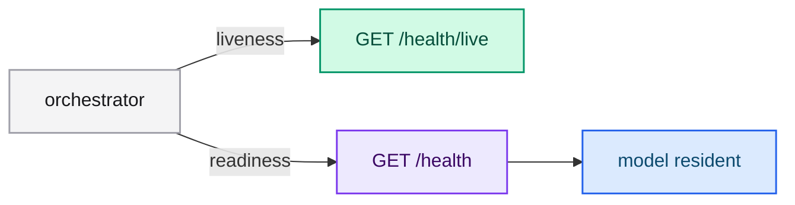

# Deploying and operating

This page covers production concerns: health checks, configuration through the
environment, resource sizing and observability. typed-lm keeps a model resident,
so most operational work happens at startup and in how you shape requests.

## Startup model

The server loads the checkpoint and prefills the system context **once** at
startup. Readiness is therefore gated on the model being loaded, which can take
seconds to minutes depending on the model size and the device.

- Use `GET /health/live` for **liveness** probes: it does not depend on the model.
- Use `GET /health` for **readiness** probes: it reports `startup_seconds`.



## Configuration through the environment

Every flag reads an environment variable, with precedence
**CLI flag > environment variable > default**. On a container platform, prefer the
environment so the image stays generic:

```bash
HOST=0.0.0.0 PORT=8080 \
MODEL_ID=Qwen/Qwen2.5-1.5B-Instruct \
CONTEXT_PATH=/etc/typed-lm/memory.md \
SESSION_CACHE_ENTRIES=64 SESSION_CACHE_TOKENS=131072 \
typed-lm-serve
```

## Sizing the session cache

The session cache trades memory for latency. Size it from your workload:

- **Many repeated states** (for example a fixed set of documents): raise
  `--session-cache-entries` so more prefixes stay resident.
- **Long prefixes**: raise `--session-cache-tokens` so a prefix is not evicted
  before it is reused.
- **One-off states**: set either limit to `0` to disable caching and save memory.

The retained cache is never mutated; each request clones it, so concurrent
requests are safe.

## Latency expectations

The cost of a request is dominated by the state prefix length and the device. A
GGUF `Q4_K_M` checkpoint with the `mkl` feature is the recommended CPU mode; a
CUDA build with `--model-dtype auto` selects F16. Measured tables are in
[Benchmarks](../engineering/benchmarks.md).

## Observability

All logs go through `tracing`, so they are structured and can be exported over
OTLP. Run with a log filter through the environment:

```bash
RUST_LOG=info,typed_lm_serve=debug typed-lm-serve
```

Keep the per-request logs for token usage and timing; they are the cheapest way
to detect a regression in request shape or cache hit rate.

## Containers

Prebuilt CPU images are published on every release:

```bash
docker pull ghcr.io/neurono-ml/typed-lm-serve:0.1.1
docker run --rm -p 8080:8080 \
  -e HF_TOKEN=<hugging-face-token> \
  -e CONTEXT_PATH=/etc/typed-lm/memory.md \
  -v "$PWD/resources/memory.md:/etc/typed-lm/memory.md:ro" \
  ghcr.io/neurono-ml/typed-lm-serve:0.1.1
```

For CUDA, build inside the devcontainer or use `cargo install --features cuda`.

## Next steps

- [Server flags](../reference/server-flags.md) — the full reference.
- [Session prefix cache](../engineering/session-cache.md) — internals.
- [Benchmarks](../engineering/benchmarks.md) — CPU and GPU numbers.
