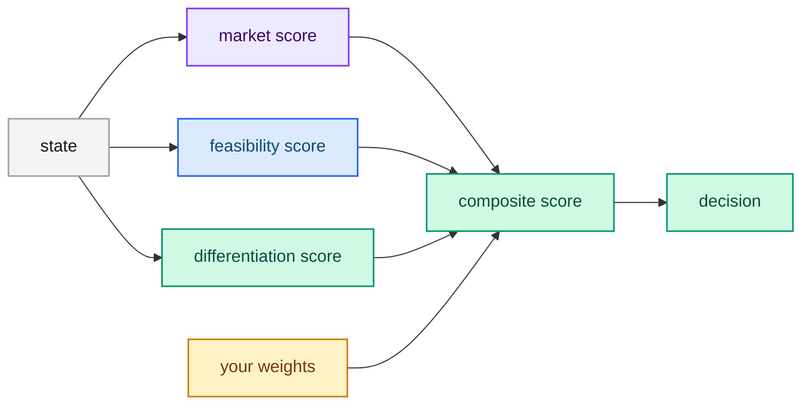

# Composite scoring

A single score for a multi-factor judgment is unreliable. Decompose the judgment
into atomic scores and combine them with weights you control in code.

## The pattern

1. Identify the independent dimensions of the judgment.
2. Ask one `score` question per dimension.
3. Combine the scores with your own weights and thresholds.



## Example request

```json
{
  "model": "jev-latest",
  "state": "A pitch for a subscription service for weekly meal planning.",
  "questions": {
    "market": {
      "type": "score",
      "instructions": "How large and reachable is the target market?",
      "criteria": ["Very small", "Small", "Moderate", "Large", "Very large"]
    },
    "feasibility": {
      "type": "score",
      "instructions": "How feasible is the technical build?",
      "criteria": ["Very hard", "Hard", "Moderate", "Easy", "Trivial"]
    },
    "differentiation": {
      "type": "score",
      "instructions": "How differentiated is this from existing products?",
      "criteria": ["Commodity", "Weak", "Moderate", "Strong", "Unique"]
    }
  }
}
```

## Combining in code

```python
answers = response["answers"]
composite = (
    0.5 * answers["market"]["score"]
    + 0.3 * answers["feasibility"]["score"]
    + 0.2 * answers["differentiation"]["score"]
)
```

When priorities change, change the coefficients — not the prompts.

## Best practices

- Normalize scores before combining if the scales differ in length.
- Weight by business impact, not by how easy a dimension is to score.
- Gate the composite with confidence when a dimension is uncertain.

## Next steps

- [Confidence-gated routing](./confidence-routing.md) — gate on certainty.
- [Score](../../concepts/score.md) — the primitive.
