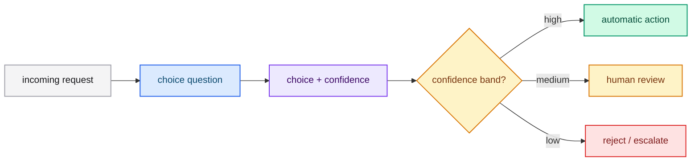

# Confidence-gated routing

Use the answer for *what* and confidence for *whether to act*. A single `choice`
question can drive a three-way decision: act automatically, route to review, or
reject.

## The pattern

1. Ask one `choice` question.
2. Read `choice` and `confidence`.
3. Route on confidence:
   - high confidence → act automatically,
   - medium confidence → send to a human,
   - low confidence → reject or escalate.



## Example request

```json
{
  "model": "typed-lm",
  "state": "The user asks whether the annual plan can be cancelled mid-cycle.",
  "questions": {
    "intent": {
      "type": "choice",
      "instructions": "Which intent best describes the user request?",
      "criteria": {
        "billing": "Payments, invoices and refunds",
        "account": "Login, profile and cancellation",
        "technical": "Product errors and setup"
      }
    }
  }
}
```

## Combining in code

```python
answer = response["answers"]["intent"]
confidence = answer["confidence"]

if confidence >= 0.85:
    dispatch[answer["choice"]](request)
elif confidence >= 0.45:
    queue_for_human(request, suggested=answer["choice"])
else:
    escalate(request, reason="low_confidence")
```

## Why it works

The distribution is calibrated by training on the same decision position the
server reads. A focused question produces a peaked distribution; a vague one
produces a flat distribution you should not automate.

## Best practices

- Calibrate the thresholds on a held-out set, not by intuition.
- Use different thresholds per question when error costs differ.
- Always log the raw `probabilities` for later recalibration.

## Next steps

- [Composite scoring](./composite-scoring.md) — combine several decisions.
- [Confidence](../../concepts/confidence.md) — the underlying concept.
