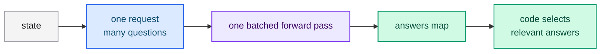

# Speculative fan-out

Send many questions in a single call, including speculative ones, and let your
code decide what is relevant. Because all questions share a prefill and are
evaluated in one batched pass, extra questions are cheap.

## The pattern

1. Batch every question that might be useful into one request.
2. Read all answers.
3. Apply only the ones your code needs for this case.



## Example request

```json
{
  "model": "jev-latest",
  "state": "The customer reports a defective medical device that a dependant uses daily.",
  "questions": {
    "refund_eligible": {
      "type": "noul",
      "instructions": "The customer is eligible for a full refund under the store policy."
    },
    "urgent": {
      "type": "score",
      "instructions": "How urgent is this case?",
      "criteria": ["Routine", "Urgent", "Emergency"]
    },
    "department": {
      "type": "choice",
      "instructions": "Which department should handle this case?",
      "criteria": {
        "billing": "Payments",
        "logistics": "Shipments",
        "product_support": "Defective-item support"
      }
    },
    "requires_manager": {
      "type": "noul",
      "instructions": "This refund requires a manager approval note."
    }
  }
}
```

## Why it works

Adding a question adds a suffix to one shared forward pass, not a new request.
The response time grows with the suffix length, not with the number of questions,
so asking several speculative questions is far cheaper than several sequential
calls.

## Best practices

- Keep questions independent; do not ask the model to condition one on another.
- Include a few speculative questions rather than a second round trip.
- Let code decide relevance; do not force the model to choose what matters.

## Next steps

- [Intent routing](./intent-routing.md) — route on a classification.
- [Questions (primitives)](../../concepts/primitives.md) — combining types.
