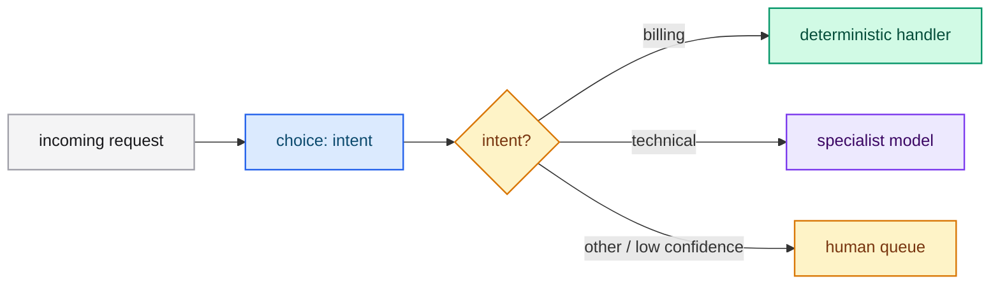

# Intent routing

Classify an incoming request into an intent and route each intent to the optimal
handler: deterministic logic, a specialist model, or a human.

## The pattern

1. Ask one `choice` question for the intent.
2. Map the chosen intent to a handler in code.
3. Fall back to a general handler when confidence is low.



## Example request

```json
{
  "model": "jev-latest",
  "state": "I was charged twice for the same order and need one charge reversed.",
  "questions": {
    "intent": {
      "type": "choice",
      "instructions": "Which intent best describes the request?",
      "criteria": {
        "billing": "Double charges, invoices and refunds",
        "logistics": "Damaged, lost or late shipments",
        "account": "Login, profile and cancellation",
        "technical": "Product errors and setup"
      }
    }
  }
}
```

## Combining in code

```python
intent = response["answers"]["intent"]
if intent["confidence"] < 0.5:
    route_to_human(request)
else:
    handlers[intent["choice"]](request)
```

## Why it works

Intent routing is a closed classification. A `choice` question with mutually
exclusive, well-described options produces a reliable label; confidence tells you
when the request is ambiguous.

## Best practices

- Keep intents mutually exclusive and business-meaningful.
- Add an explicit `other` only if "other" is a real outcome.
- Use a hierarchy for large taxonomies: coarse intent first, then a second call.
- Re-check low-confidence requests instead of guessing.

## Next steps

- [Speculative fan-out](./fan-out.md) — ask intent and other questions at once.
- [Choice](../../concepts/choice.md) — the primitive.
