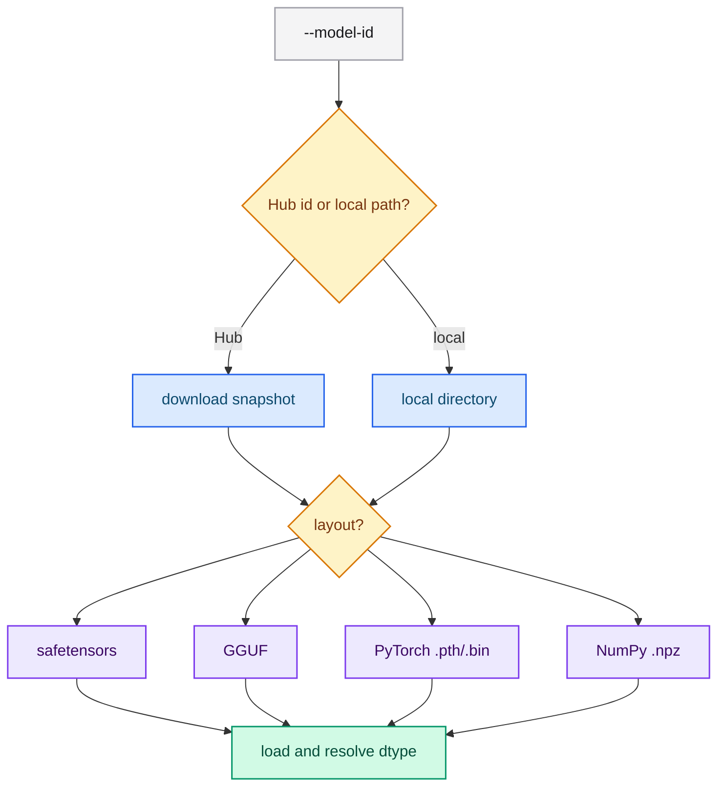

# Running the server

`typed-lm-serve` is a single binary (no subcommand) that loads a model once at
startup and exposes the Jev-compatible HTTP API. This guide covers building it,
starting it for CPU and GPU inference, and the operational flags.

## Prerequisites

- Rust stable (edition 2021).
- Optional: an NVIDIA GPU with a working driver for CUDA inference.
- Optional: the NVIDIA container toolkit to run CUDA inside the devcontainer.

## Build

```bash
# CPU
cargo build --release -p typed-lm-serve

# CPU with Intel MKL (BLAS acceleration on x86)
cargo build --release -p typed-lm-serve --features mkl

# CUDA (F16 weights selected automatically by --model-dtype auto)
cargo build --release -p typed-lm-serve --features cuda
```

Do not pass `--all-features` on Linux: the `metal` feature only builds on macOS.

## Start the server

```bash
# Default model (Qwen/Qwen2.5-1.5B-Instruct), downloaded on first startup.
cargo run -p typed-lm-serve

# With a memory context file and a released build.
cargo run --release -p typed-lm-serve --features mkl -- \
  --model-id Qwen/Qwen2.5-1.5B-Instruct \
  --context-path resources/memory.md
```

The server listens on `0.0.0.0:8080` by default. Verify it is up:

```bash
curl -s http://127.0.0.1:8080/health/live
curl -s http://127.0.0.1:8080/health
curl -s http://127.0.0.1:8080/v1/models
```

## Run from a container

Prebuilt images for both binaries are published to the GitHub Container Registry
on every release. CPU images carry `latest` and the version; CUDA images add a
`-cuda` suffix (and the `cuda` tag):

```bash
# CPU
docker pull ghcr.io/neurono-ml/typed-lm-serve:latest
docker pull ghcr.io/neurono-ml/typed-lm-trainer:latest

# CUDA (GPU)
docker pull ghcr.io/neurono-ml/typed-lm-serve:cuda
docker pull ghcr.io/neurono-ml/typed-lm-trainer:cuda
```

| Image | Accelerator | Contents |
|---|---|---|
| `ghcr.io/neurono-ml/typed-lm-serve` | CPU | The Jev-compatible HTTP server |
| `ghcr.io/neurono-ml/typed-lm-trainer` | CPU | `train` and `quantize` |
| `.../typed-lm-serve:cuda` | CUDA | Server with the CUDA runtime libraries |
| `.../typed-lm-trainer:cuda` | CUDA | Trainer with the CUDA runtime libraries |

Run the server, passing an `HF_TOKEN` for gated models and mounting a context
file and a cache volume so the weights survive across runs:

```bash
docker run --rm -p 8080:8080 \
  -e HF_TOKEN=<hugging-face-token> \
  -v typed-lm-cache:/root/.cache/huggingface \
  -v "$PWD/resources/memory.md:/etc/typed-lm/memory.md:ro" \
  -e CONTEXT_PATH=/etc/typed-lm/memory.md \
  ghcr.io/neurono-ml/typed-lm-serve:0.1.1
```

Run the trainer with the working directory mounted at `/work`:

```bash
docker run --rm -v "$PWD:/work" -w /work \
  -e HF_TOKEN=<hugging-face-token> \
  ghcr.io/neurono-ml/typed-lm-trainer:0.1.1 train \
  --model-id /work/checkpoint \
  --dataset /work/resources/dataset.jsonl \
  --output-directory /work/output/train \
  --method lora --epochs 3 --batch-size 4 --learning-rate 1e-4
```

Every server flag still applies after the image name; they can also come from
the environment.

### GPU (CUDA)

The CUDA images bundle the runtime libraries candle loads (`cudart`, `cublas`,
`curand`, `nvrtc`); the host only needs the NVIDIA driver and the container
toolkit. Pass `--gpus all` and let `--model-dtype auto` select F16 weights:

```bash
docker run --rm --gpus all -p 8080:8080 \
  -e HF_TOKEN=<hugging-face-token> \
  -e MODEL_DTYPE=auto \
  -v typed-lm-cache:/root/.cache/huggingface \
  ghcr.io/neurono-ml/typed-lm-serve:cuda
```

The trainer runs on the GPU the same way, with `--device cuda`:

```bash
docker run --rm --gpus all -v "$PWD:/work" -w /work \
  -e HF_TOKEN=<hugging-face-token> \
  ghcr.io/neurono-ml/typed-lm-trainer:cuda train \
  --model-id /work/checkpoint \
  --dataset /work/resources/dataset.jsonl \
  --output-directory /work/output/train \
  --method lora --device cuda --epochs 3 --batch-size 4 --learning-rate 1e-4
```

To build the CUDA image from source instead (the release pipeline does this
automatically), use the multi-stage Dockerfile and tune the compute capability
for the target GPU:

```bash
docker build -f docker/Dockerfile.serve-cuda \
  --build-arg CUDA_COMPUTE_CAP=80 -t typed-lm-serve:cuda .
```

## Configuration flags

Every flag also reads an environment variable; precedence is
**CLI flag > environment variable > default**.

| CLI flag | Environment variable | Default |
|---|---|---|
| `--host` | `HOST` | `0.0.0.0` |
| `--port` | `PORT` | `8080` |
| `--model-id` | `MODEL_ID` | `Qwen/Qwen2.5-1.5B-Instruct` |
| `--model-revision` | `MODEL_REVISION` | `main` |
| `--weights-file` | `WEIGHTS_FILE` | auto-detected |
| `--tokenizer-file` | `TOKENIZER_FILE` | next to the weights |
| `--config-file` | `CONFIG_FILE` | next to the weights |
| `--context-path` | `CONTEXT_PATH` | missing = empty context |
| `--served-model-name` | `SERVED_MODEL_NAME` | `typed-lm` |
| `--model-dtype` | `MODEL_DTYPE` | `auto` (F32 on CPU, F16 on CUDA/Metal) |
| `--session-cache-entries` | `SESSION_CACHE_ENTRIES` | `16` |
| `--session-cache-tokens` | `SESSION_CACHE_TOKENS` | `32768` |
| `--hf-token` | `HF_TOKEN` | missing |

```bash
PORT=9090 MODEL_ID=recogna-nlp/bode-1b-instruct cargo run -p typed-lm-serve
```

The complete reference is in [Server flags](../reference/server-flags.md).

## Model sources and layouts

`--model-id` accepts a Hugging Face repository identifier or a local path. The
layout is detected automatically:

- **safetensors** — a single file, a sharded set backed by
  `model.safetensors.index.json`, or a directory of snapshot symlinks;
- **GGUF** — dense or GGML-quantized (for example `Q4_K_M`);
- **PyTorch** `.pth`/`.bin` and **NumPy** `.npz`.

Weight kinds: full precision (`BF16`/`F16`/`F32`), GGML-quantized (GGUF), and
**FP8 (`F8_E4M3`/`F8_E5M2`)** and **FP4 (MXFP4)**. The last two are dequantized on
load to dense F32 because Candle has no matmul kernel for them. `GPTQ` and `AWQ`
are rejected with a clear message.



## GPU (CUDA) via the devcontainer

The host only needs the NVIDIA driver and the NVIDIA container toolkit. The
devcontainer installs the CUDA toolkit through the `nvidia-cuda` feature and
reserves the GPU in `docker-compose.yml`.

```bash
# Inside the devcontainer.
nvidia-smi                          # confirm the GPU is visible
cargo build --release -p typed-lm-serve --features cuda
cargo run --release -p typed-lm-serve --features cuda -- \
  --model-id Qwen/Qwen2.5-1.5B-Instruct \
  --context-path resources/memory.md
```

With `--model-dtype auto` the server selects F16 weights on CUDA.

## CPU acceleration

The recommended CPU mode is a GGUF `Q4_K_M` checkpoint (roughly half the cost per
request of the dense `F32` path) combined with the `mkl` feature and the fused CPU
flash attention (used automatically, keeping GQA grouped).

```bash
cargo run --release -p typed-lm-serve --features mkl -- \
  --model-id Qwen/Qwen2.5-1.5B-Instruct-GGUF \
  --weights-file qwen2.5-1.5b-instruct-q4_k_m.gguf \
  --context-path resources/memory.md
```

`.cargo/config.toml` sets `target-cpu=native`; compile and run on the same machine
(remove it when cross-compiling).

## Session prefix cache

The expensive part of a request is the forward pass over the state prefix (system
context + `state`). The server tokenizes `system + state` once and keeps the
resulting KV-cache in a bounded LRU keyed by a canonical hash of the state. A
state that reappears across requests skips that forward pass. The cache is bounded
by the number of entries (`--session-cache-entries`) and the total cached tokens
(`--session-cache-tokens`); the least recently used entries are evicted first.
Setting either limit to `0` disables session caching. The retained cache is never
mutated: every request clones it before use.

## Restricted (gated) models

If you switch to a gated model via `--model-id`, accept its terms on the model
page and export a read token before starting the server:

```bash
HF_TOKEN=hf_your_token cargo run -p typed-lm-serve -- \
  --model-id recogna-nlp/bode-1b-instruct
```

Without the token the download fails with `401` — expected behavior, not a bug.

## Next steps

- [Calling the API](./api.md) — routes, contract and `curl` examples.
- [Deploying and operating](./operations.md) — production concerns.
- [Supported architectures](../reference/architectures.md) — the density families.
