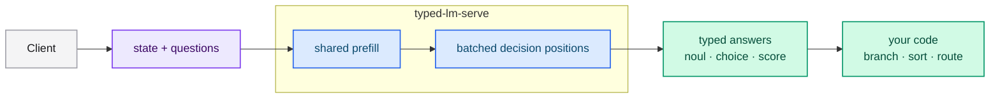

# typed-lm

<div class="sk-hero reveal">
  <div class="sk-announce">
    <span class="sk-announce__tag">New</span>
    Deterministic inference · Adapter training · Apache-2.0
  </div>
  <h1 class="sk-hero__title">Structured decisions in a single forward pass.</h1>
  <p class="sk-hero__subtitle">
    <strong>typed-lm</strong> turns dense decoder models — Llama, Qwen2, Qwen3, Mistral,
    Gemma, Gemma2 and Gemma3 — into a typed semantic-routing API. Send a <em>state</em>
    and typed <em>questions</em>; receive booleans, choices and scores your code can branch
    on. No text generation, no parsing.
  </p>
  <div class="sk-btn-row">
    <a class="sk-btn sk-btn--star" href="https://github.com/neurono-ml/typed-lm">⭐ Star on GitHub</a>
    <a class="sk-btn sk-btn--primary" href="./quickstart.html">Quick start</a>
    <a class="sk-btn sk-btn--secondary" href="./guides/api.html">API reference</a>
  </div>
</div>

<div class="sk-stats reveal">
  <div class="sk-stats__item"><div class="sk-stats__value js-count" data-target="7">7</div><span class="sk-stats__label">dense model families</span></div>
  <div class="sk-stats__item"><div class="sk-stats__value js-count" data-target="3">3</div><span class="sk-stats__label">question primitives</span></div>
  <div class="sk-stats__item"><div class="sk-stats__value js-count" data-target="4">4</div><span class="sk-stats__label">training methods</span></div>
  <div class="sk-stats__item"><div class="sk-stats__value">1</div><span class="sk-stats__label">forward pass per request</span></div>
</div>

## What does typed-lm do?

typed-lm is a Rust workspace with a Jev-compatible HTTP server and a trainer. The
server loads a dense decoder checkpoint once and answers typed questions from the
**logits at a single decision position**, instead of generating text.



## Why typed decisions?

Text-generation APIs force you to coerce a generative model into emitting
structured output and then parse it back. typed-lm removes that mismatch: the
model is scored with a restricted cross-entropy at the decision position, and the
API returns a typed value plus a calibrated distribution.

<div class="sk-cards reveal">
  <div class="sk-card"><span class="sk-card__icon">⚡</span><div class="sk-card__title">One forward pass</div><p>All questions in a request share a prefill and are evaluated in one batched pass. Adding questions barely changes latency.</p></div>
  <div class="sk-card"><span class="sk-card__icon">🎯</span><div class="sk-card__title">Calibrated by training</div><p>LoRA, QLoRA and full training optimize the exact decision-position loss the server reads at inference.</p></div>
  <div class="sk-card"><span class="sk-card__icon">🧩</span><div class="sk-card__title">Jev-compatible</div><p>Drop-in compatible with the Jev contract: <code>noul</code>, <code>choice</code> and <code>score</code>, combinable in one call.</p></div>
  <div class="sk-card"><span class="sk-card__icon">📦</span><div class="sk-card__title">Servable artifacts</div><p>FP8/FP4 quantization and full/from-scratch checkpoints are served directly by the same binary.</p></div>
</div>

## The API you will call

```bash
curl -s http://127.0.0.1:8080/v1/systemone \
  -H 'Content-Type: application/json' \
  -d @examples/request_mixed.json
```

```json
{
  "model": "jev-latest",
  "answers": {
    "refund_eligible": { "type": "noul", "noul": 0.87 },
    "responsible_department": {
      "type": "choice",
      "choice": "logistics",
      "probabilities": { "billing": 0.05, "logistics": 0.9, "product_support": 0.05 },
      "confidence": 0.85
    },
    "urgency": {
      "type": "score",
      "score": 1.2,
      "legend": { "0": "Routine", "1": "Urgent", "2": "Emergency" },
      "probabilities": { "0": 0.2, "1": 0.4, "2": 0.4 },
      "confidence": 0.2
    }
  },
  "usage": { "input_tokens": 512, "output_tokens": 4 }
}
```

<div class="sk-box sk-box--tip">
<strong>Next step:</strong> follow the <a href="./quickstart.html">Quick start</a> to build the
server, send your first request and train a LoRA adapter.
</div>

## Who is it for?

- **Platform teams** that need fast, auditable decisions instead of generated text.
- **ML engineers in Rust** who want deterministic inference and a training and quantization pipeline.
- **Jev users** who want a self-hosted, open-source implementation of the same contract.

<div class="sk-statement reveal">
  <p class="sk-statement__text">The Jev contract,<br/>on your own model and your own hardware.</p>
</div>

<div class="sk-cta reveal">
  <div class="sk-cta__title">Build with us</div>
  <p>typed-lm is open source (Apache-2.0) and advances crate by crate. Contributions are
  welcome — from datasets and prompts to CUDA backends.</p>
  <div class="sk-btn-row">
    <a class="sk-btn sk-btn--star" href="https://github.com/neurono-ml/typed-lm">⭐ Leave a star</a>
    <a class="sk-btn sk-btn--primary" href="./community/contributing.html">How to contribute</a>
  </div>
</div>
