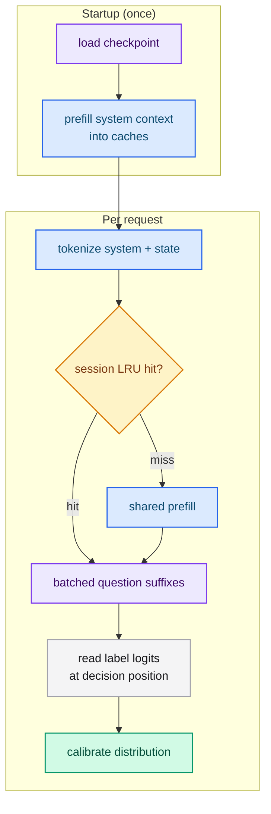

# What is typed-lm?

Large language models are designed to produce text for humans. When your software
needs a judgment it can branch on, coercing a generative model into structured
output creates a mismatch: you prompt, you parse, you validate, and you still get
a string. **typed-lm** removes the mismatch. It evaluates typed questions against
a state and returns typed results directly.

## What problem does it solve?

A routing or triage system usually asks simple, well-scoped questions: *is the
customer eligible for a refund?*, *which department owns this case?*, *how urgent
is it?*. Each has a small, closed answer set. typed-lm answers exactly those
questions from a single forward pass over a dense decoder checkpoint, reading the
model's logits at one decision position and calibrating them into a distribution.

Because the answer is a number or a label rather than free text, your application
can branch on it, sort by it and threshold it without a parser in the loop.

## How it works, in one diagram

## What can it run?

The architecture is detected from the `model_type` field in `config.json`; no flag
is needed. The supported dense decoder families are:

| Family | `model_type` |
|---|---|
| Llama | `llama` |
| Qwen2 | `qwen2` |
| Qwen3 | `qwen3` |
| Mistral | `mistral` |
| Gemma | `gemma` |
| Gemma2 | `gemma2` |
| Gemma3 | `gemma3` |

Mixture-of-Experts and multi-head-latent-attention families are not supported and
are rejected at load time with an actionable error: `mixtral`, `qwen3_moe`,
`deepseek_v2` (also `deepseek2`) and `deepseek_v3`. Dense safetensors, PyTorch and
NumPy checkpoints of any of the seven families are served. GGUF-quantized serving
is Qwen2-only.

## The three primitives

| Question | Goal | Returns |
|---|---|---|
| **Noul** | Is this statement true? | `noul` (0.0 to 1.0) |
| **Choice** | Pick one option from a closed set | `choice`, `probabilities`, `confidence` |
| **Score** | Rate the state on ordered levels | `score`, `legend`, `probabilities`, `confidence` |

All three can be combined in one request, and each question is evaluated
independently against the same state. See
[Questions (primitives)](./concepts/primitives.md).

## What comes in the box?

- **`typed-lm-serve`** — a single binary that loads a model once and exposes the
  Jev-compatible HTTP API.
- **`typed-lm-trainer`** — LoRA, QLoRA, full and from-scratch training plus FP8/FP4
  post-training quantization, with the subcommands `train` and `quantize`.
- **`typed-lm-common`** — the shared library that defines the Jev contract, the
  label arithmetic, the prompt rendering, checkpoint detection and the
  quantization helpers, so the server and the trainer always agree.

## typed-lm and Jev

typed-lm implements the Jev (TypeSafe AI) HTTP contract so existing Jev clients can
point at a self-hosted model. See
[typed-lm and Jev](./concepts/comparison-with-jev.md) for the compatibility table
and the differences.

## Next steps

- [Quick start](./quickstart.md) — run the server and send your first request.
- [System One decisions](./concepts/system-one.md) — why a single forward pass.
- [Training tutorial](./training/index.md) — datasets, configuration and adapters.
