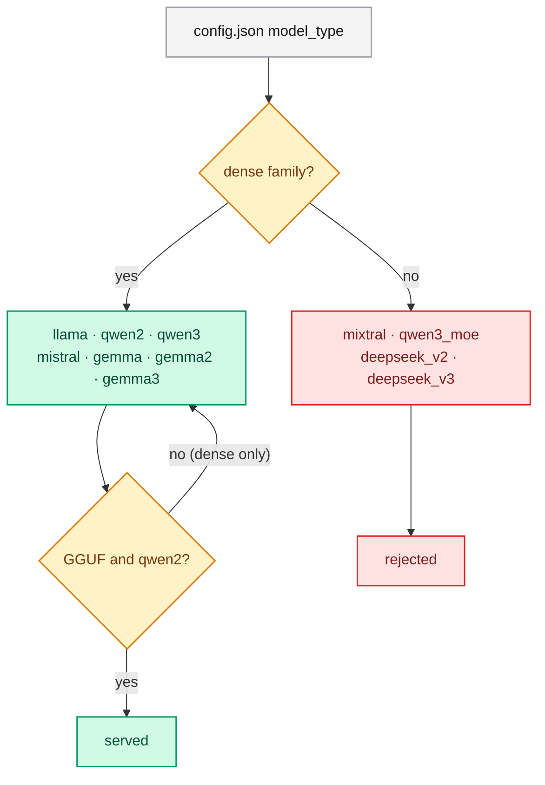

# Supported architectures

The architecture is detected automatically from the `model_type` field in
`config.json`; no flag is needed.

## Supported dense families

| Family | `model_type` |
|---|---|
| Llama | `llama` |
| Qwen2 | `qwen2` |
| Qwen3 | `qwen3` |
| Mistral | `mistral` |
| Gemma | `gemma` |
| Gemma2 | `gemma2` |
| Gemma3 | `gemma3` |

## Rejected families

Mixture-of-Experts and multi-head-latent-attention families are **not supported**
and are rejected at load time with an actionable error:

| Rejected `model_type` | Reason |
|---|---|
| `mixtral` | Mixture-of-Experts |
| `qwen3_moe` | Mixture-of-Experts |
| `deepseek_v2` (also `deepseek2`) | Multi-head latent attention |
| `deepseek_v3` | Multi-head latent attention |

DeepSeek is therefore excluded.

## Dense versus GGUF

Dense safetensors, PyTorch and NumPy checkpoints of any of the seven families are
served. **GGUF-quantized serving is Qwen2-only**: a GGUF checkpoint declaring
another architecture is rejected, and a non-Qwen2 model must be converted to a
dense format first.

## Related

- [Running the server](../guides/running.md) — layouts and weight kinds.
- [Choosing an architecture](../training/architecture.md) — geometry for training.
