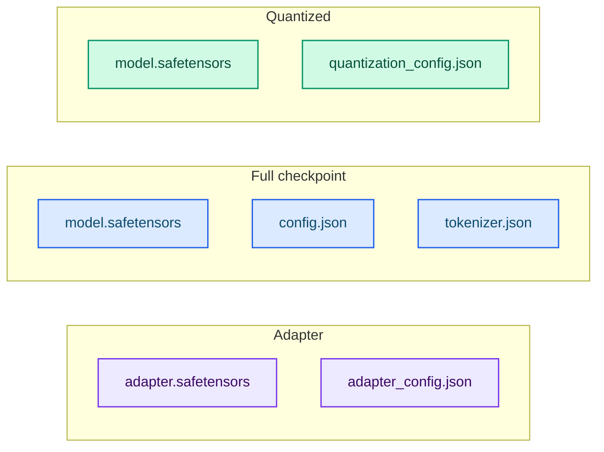

# Artifact formats

This page documents what each training and quantization run writes, and how the
server resolves a directory.

## Training artifacts

| Method | Files | Servable directly? |
|---|---|---|
| `lora` / `qlora` | `adapter.safetensors`, `adapter_config.json` | No — merge first |
| `full` / `from-scratch` | `model.safetensors`, `config.json`, `tokenizer.json` | Yes |

### `adapter_config.json`

```json
{
  "rank": 16,
  "alpha": 32.0,
  "model_identifier": "/path/to/local/checkpoint",
  "architecture": "llama"
}
```

Adapter tensor names: `model.layers.{index}.<projection>.lora_a` and `.lora_b` for
`q_proj`, `k_proj`, `v_proj`, `o_proj`, `gate_proj`, `up_proj` and `down_proj`.

## Quantization artifacts

| Scheme | Files | Stored layout |
|---|---|---|
| `none` | `model.safetensors` | Dense `F32`, no extra tensors |
| `fp8` | `model.safetensors`, `quantization_config.json` | `F8_E4M3` + per-channel `<weight>_scale` |
| `fp4` | `model.safetensors`, `quantization_config.json` | E2M1 nibbles in `U8` + `U8` F8E8M0 `<weight>_scale` + `<weight>_shape` |

`quantization_config.json`:

```json
{
  "scheme": "fp8",
  "block_size": 32
}
```

FP8 and FP4 are dequantized to dense F32 on load, because Candle has no matmul
kernel for them.



## Canonical tensor names

`full` and `from-scratch` write canonical Hugging Face tensor names the serving
loader reads: `model.embed_tokens.weight`, `model.norm.weight`,
`model.layers.N.input_layernorm.weight`,
`model.layers.N.post_attention_layernorm.weight`,
`model.layers.N.self_attn.{q,k,v,o}_proj.weight`, the Gemma2/Gemma3
`pre_feedforward_layernorm`/`post_feedforward_layernorm` and
`self_attn.{q,k}_norm` weights, the `mlp.{gate,up,down}_proj.weight`, plus
`lm_head.weight` when the embeddings are untied.

## Serving resolution

The server detects the layout of `--model-id` automatically:

- **safetensors** — single file, sharded with `model.safetensors.index.json`, or a
  directory of snapshot symlinks;
- **GGUF** — dense or GGML-quantized (Qwen2-only);
- **PyTorch** `.pth`/`.bin` and **NumPy** `.npz`;
- **FP8/FP4** — detected and dequantized on load.

## Related

- [Serving a trained artifact](../training/serving-artifacts.md)
- [Quantization (FP8 and FP4)](../training/quantization.md)
- [Running the server](../guides/running.md)
