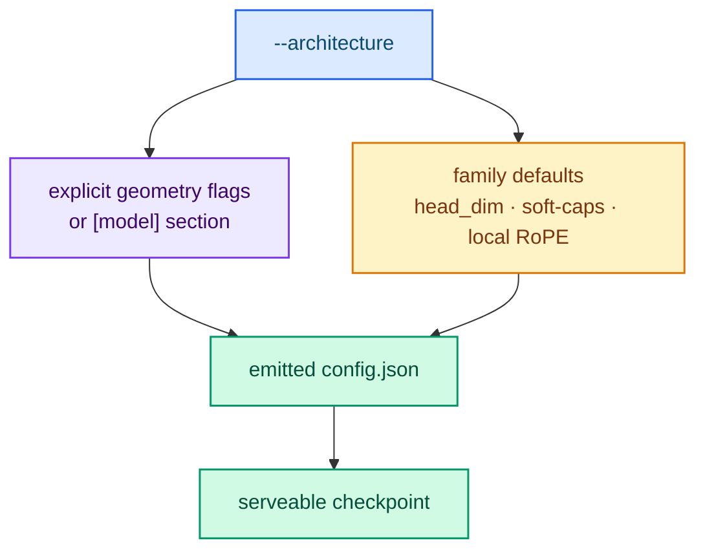

# Choosing an architecture

The model geometry determines the checkpoint layout the trainer writes and the
server reads. Most users never set it explicitly: `lora`, `qlora` and `full` read
the geometry — and the tokenizer — from the base checkpoint's `config.json`. Only
`from-scratch` requires an explicit geometry, because there is no checkpoint to
read it from.

## When do I need to set geometry?

| Method | Geometry source |
|---|---|
| `lora` / `qlora` | Base checkpoint `config.json` |
| `full` | Base checkpoint `config.json` |
| `from-scratch` | Flags or the TOML `[model]` section (required) |

## Supported families

The `--architecture` flag selects the family:

| Family | `--architecture` |
|---|---|
| Llama | `llama` |
| Qwen2 | `qwen2` |
| Qwen3 | `qwen3` |
| Mistral | `mistral` |
| Gemma | `gemma` |
| Gemma2 | `gemma2` |
| Gemma3 | `gemma3` |

## Geometry fields

| Flag | Description |
|---|---|
| `--hidden-size` | Hidden dimension |
| `--intermediate-size` | Feed-forward intermediate dimension |
| `--num-hidden-layers` | Number of transformer blocks |
| `--num-attention-heads` | Number of query heads |
| `--head-dim` | Head dimension (default: `hidden_size / num_attention_heads`) |
| `--num-key-value-heads` | Number of key/value heads (GQA) |
| `--vocab-size` | Vocabulary size |
| `--max-position-embeddings` | Maximum sequence length |
| `--rope-theta` | Rotary embedding base frequency |
| `--rms-norm-eps` | RMS normalization epsilon |
| `--tie-word-embeddings` | Input and output embeddings share weights |
| `--attention-bias` | Attention projections carry a bias |
| `--sliding-window` | Sliding-window size |
| `--sliding-window-pattern` | Gemma3 global/local alternation |
| `--rope-local-base-frequency` | Gemma3 local RoPE base frequency |
| `--query-pre-attention-scalar` | Gemma2/Gemma3 attention scaling denominator |
| `--logit-softcapping` | Gemma2/Gemma3 `final_logit_softcapping` |
| `--attention-logit-softcapping` | Gemma2/Gemma3 `attn_logit_softcapping` |

Fields left unset take the family default — `head_dim` derivation, soft-caps,
Gemma3 local RoPE and window, attention bias — so the emitted `config.json` is
always serveable by `typed-lm-serve`.



## Choosing a geometry for from-scratch

There is no "right" size for a from-scratch model; pick the smallest geometry that
exercises your dataset and pipeline. A small model trains quickly and still
produces a serveable checkpoint.

```bash
cargo run --release -p typed-lm-trainer -- train \
  --method from-scratch \
  --architecture qwen2 \
  --vocab-size 151936 \
  --hidden-size 512 \
  --intermediate-size 2048 \
  --num-hidden-layers 8 \
  --num-attention-heads 8 \
  --num-key-value-heads 4 \
  --max-position-embeddings 1024 \
  --tokenizer-file /path/to/tokenizer.json \
  --dataset resources/dataset.jsonl \
  --output-directory output/scratch \
  --seed 42 \
  --epochs 3 --batch-size 4 --learning-rate 1e-4
```

See [Training from scratch](./from-scratch.md) for the caveats about the resulting
model.

## Next steps

- [Training from scratch](./from-scratch.md) — the full walkthrough.
- [Configuration file (TOML)](../reference/configuration-file.md) — the `[model]` section.
- [Supported architectures](../reference/architectures.md) — what the server serves.
