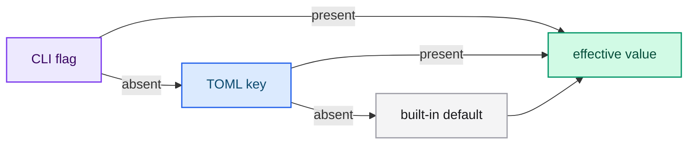

# Configuring a run (CLI and TOML)

Any `train` invocation can be shortened with `--configuration-file <path.toml>`.
Values resolve with the precedence **CLI flag > TOML key > default**: an explicit
flag always wins, an absent flag takes the TOML value, and an absent key takes the
built-in default.

```bash
cargo run --release -p typed-lm-trainer -- train \
  --configuration-file training.toml
```

## Sections

The file is organized in five sections that mirror the runtime concerns:

| Section | Purpose |
|---|---|
| `[run]` | Training method, hyper-parameters and execution settings |
| `[model]` | Architecture geometry (needed by `from-scratch`/`full`) |
| `[initialization]` | Weight initializers for `from-scratch` |
| `[dataset]` | Dataset location |
| `[tokenizer]` | Tokenizer artifact |



## Full example

```toml
[run]
method = "from-scratch"
seed = 42
output_directory = "output/scratch"
model_id = "Qwen/Qwen2.5-1.5B-Instruct"
quantization = "none"
quantization_mode = "post-training"
device = "auto"
maximum_gradient_norm = 1.0
minimum_improvement = 0.0
early_stop_patience = 0
max_sequence_length = 1024
warmup_steps = 10
weight_decay = 0.0
learning_rate = 1e-4
batch_size = 4
gradient_accumulation_steps = 1
epochs = 3
lora_rank = 16
lora_alpha = 32.0
lora_dropout = 0.0

[model]
architecture = "qwen3"
vocab_size = 151936
hidden_size = 1024
intermediate_size = 4096
num_hidden_layers = 16
num_attention_heads = 16
num_key_value_heads = 4
max_position_embeddings = 4096
rope_theta = 1000000.0
rms_norm_eps = 1e-6
tie_word_embeddings = true

[initialization]
initializer_range = 0.02
embedding_std = 0.02
norm_weight = 1.0
bias_value = 0.0

[dataset]
path = "resources/dataset.jsonl"

[tokenizer]
file = "tokenizer.json"
```

## `[run]`

| TOML key | Type | CLI flag | Default |
|---|---|---|---|
| `method` | string | `--method` | `lora` |
| `seed` | integer | `--seed` | `42` |
| `output_directory` | string | `--output-directory` | `output/train` |
| `model_id` | string | `--model-id` | `Qwen/Qwen2.5-1.5B-Instruct` |
| `quantization` | string | `--quantization` | `none` |
| `quantization_mode` | string | `--quantization-mode` | `post-training` |
| `device` | string | `--device` | `auto` |
| `maximum_gradient_norm` | float | `--maximum-gradient-norm` | `1.0` |
| `minimum_improvement` | float | `--minimum-improvement` | `0.0` |
| `early_stop_patience` | integer | `--early-stop-patience` | `0` |
| `max_sequence_length` | integer | `--max-sequence-length` | `1024` |
| `warmup_steps` | integer | `--warmup-steps` | `10` |
| `weight_decay` | float | `--weight-decay` | `0.0` |
| `learning_rate` | float | `--learning-rate` | `1e-4` |
| `batch_size` | integer | `--batch-size` | `4` |
| `gradient_accumulation_steps` | integer | `--gradient-accumulation-steps` | `1` |
| `epochs` | integer | `--epochs` | `3` |
| `lora_rank` | integer | `--lora-rank` | `16` |
| `lora_alpha` | float | `--lora-alpha` | `32.0` |
| `lora_dropout` | float | `--lora-dropout` | `0.0` |

The `device` value accepts `auto`, `cpu` or `cuda` and mirrors the CLI choices.

## `[model]`

Explicit architecture geometry, used by `--method full`/`from-scratch` when the
shape must not come from a checkpoint `config.json`. Each key maps to the
same-named CLI flag.

| TOML key | Type | CLI flag |
|---|---|---|
| `architecture` | string | `--architecture` |
| `vocab_size` | integer | `--vocab-size` |
| `hidden_size` | integer | `--hidden-size` |
| `intermediate_size` | integer | `--intermediate-size` |
| `num_hidden_layers` | integer | `--num-hidden-layers` |
| `num_attention_heads` | integer | `--num-attention-heads` |
| `head_dim` | integer | `--head-dim` |
| `num_key_value_heads` | integer | `--num-key-value-heads` |
| `max_position_embeddings` | integer | `--max-position-embeddings` |
| `rope_theta` | float | `--rope-theta` |
| `rms_norm_eps` | float | `--rms-norm-eps` |
| `tie_word_embeddings` | boolean | `--tie-word-embeddings` |
| `attention_bias` | boolean | `--attention-bias` |
| `sliding_window` | integer | `--sliding-window` |
| `sliding_window_pattern` | integer | `--sliding-window-pattern` |
| `rope_local_base_frequency` | float | `--rope-local-base-frequency` |
| `query_pre_attention_scalar` | integer | `--query-pre-attention-scalar` |
| `logit_softcapping` | float | `--logit-softcapping` |
| `attention_logit_softcapping` | float | `--attention-logit-softcapping` |

Any key left absent falls back to the family default: `head_dim` derives from
`hidden_size / num_attention_heads`, Gemma2/Gemma3 fill `query_pre_attn_scalar`,
the logit soft-caps, the Gemma3 local RoPE base frequency and its sliding-window
pattern automatically. This guarantees the emitted `config.json` can be served back
for every dense family.

## `[initialization]`

Weight initializers for `--method from-scratch`. These keys have **no CLI flag**;
they are applied over the built-in defaults. Absent keys keep their default.

| TOML key | Type | Default | Meaning |
|---|---|---|---|
| `initializer_range` | float | `0.02` | Standard deviation of attention and MLP projection weights |
| `embedding_std` | float | `0.02` | Standard deviation of the token-embedding (and untied head) weights |
| `norm_weight` | float | `1.0` | Constant written to every RMSNorm weight |
| `bias_value` | float | `0.0` | Constant written to every attention-projection bias |

## `[dataset]`

| TOML key | Type | CLI flag | Default |
|---|---|---|---|
| `path` | string | `--dataset` | — (required: CLI or TOML) |

## `[tokenizer]`

| TOML key | Type | CLI flag | Default |
|---|---|---|---|
| `file` | string | `--tokenizer-file` | — (required by `from-scratch`) |

## Precedence

Each parameter resolves with the rule **CLI flag > TOML key > default**. Worked
example, using `epochs` (default `3`) and this file:

```toml
[run]
epochs = 9
```

| Invocation | Result | Rule |
|---|---|---|
| `train --dataset data.jsonl --epochs 2 --configuration-file training.toml` | `epochs = 2` | flag set → wins |
| `train --dataset data.jsonl --configuration-file training.toml` | `epochs = 9` | flag absent + TOML present → TOML |
| `train --dataset data.jsonl` | `epochs = 3` | both absent → default |

The rule is applied per key, not per section: in one file some keys can come from
the CLI and others from the TOML at the same time.

## Errors

Unknown keys and wrong types are rejected rather than silently ignored. Both
surface as a typed configuration-file error naming the file and the offending key,
for example:

```text
configuration file error in 'training.toml': unknown field `epocs`, expected one of ...
configuration file error in 'training.toml': invalid type: string "three", expected usize ...
```

A missing file is reported as an I/O error carrying the path.

## Next steps

- [Configuration file (TOML)](../reference/configuration-file.md) — the reference.
- [Training LoRA and QLoRA adapters](./lora-qlora.md) — the run.
- [Choosing an architecture](./architecture.md) — the `[model]` section.
