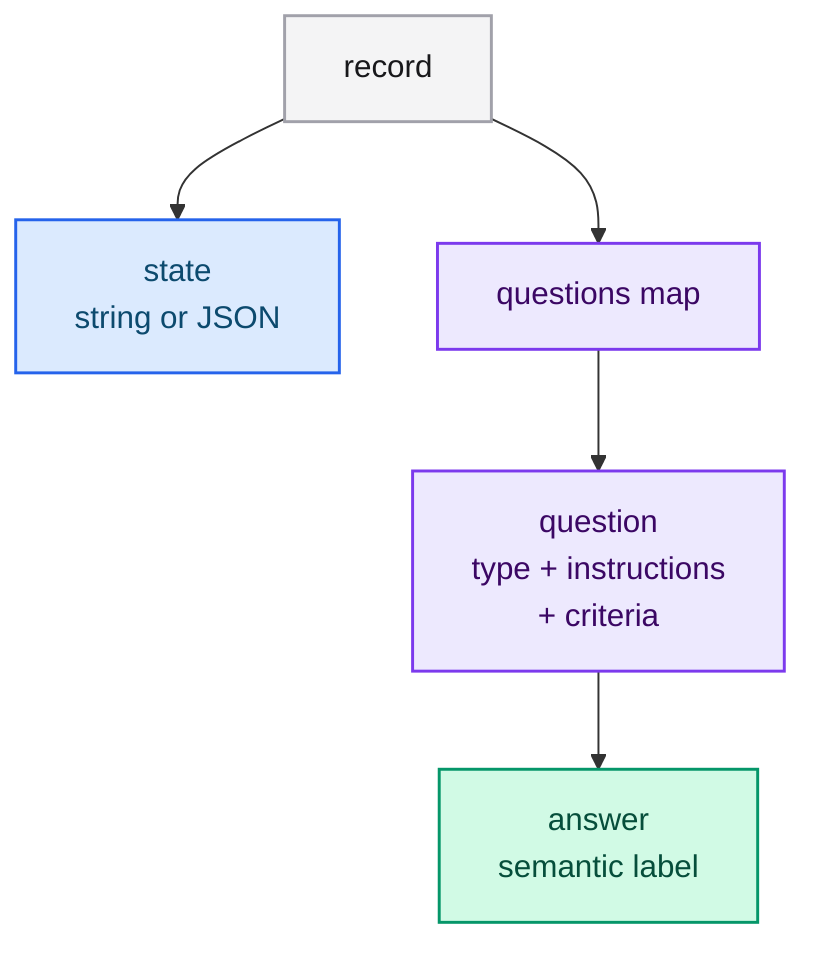
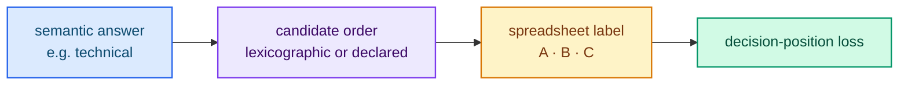

# Preparing datasets

A typed-lm dataset is **Jev-native**: each record mirrors the Jev request contract
(`state` + a map of `questions`) and adds an `answer` to every question. The
trainer reads the same shapes the server serves, so there is no separate
"training format" to maintain.

## Record shape

Every record must be a JSON **object** with:

- `state` — a string (free text) or any JSON value (structured state);
- `questions` — a non-empty object mapping a question name to its definition;
- each question — the serving-contract shape (`type` + `instructions`, plus
  `criteria` where required) **plus** an `answer` string.

Unknown keys are rejected: a question is the contract shape plus `answer` only.



## Which files are accepted?

| Input | Description |
|---|---|
| `.jsonl` | One JSON object per line; blank lines are skipped. |
| `.json` (object) | A single record object. |
| `.json` (array) | An array of record objects. |
| directory | Scanned **recursively** for `.jsonl`/`.json`; files are sorted. |

The file extension is case-insensitive. Errors name the file, and the line for
JSONL, so a malformed dataset is fixable without guesswork.

## Question shapes and `answer`

The `answer` is **semantic** and must be one of the question's candidates:

- `noul` → `"yes"` / `"no"`, or the labels declared in `criteria`
  (`{"yes": "...", "no": "..."}`; default `"Yes"`/`"No"`);
- `choice` → the option **name** (a key of `criteria`);
- `score` → the level **name** (an element of the `criteria` array).

`criteria` per type:

- `noul` — optional object `{"yes": "...", "no": "..."}` (also accepts the aliases
  `true`/`false`);
- `choice` — required object mapping each option name to a description (the value
  may be `null` when no description is needed);
- `score` — required array of 2 to 10 level names, in increasing order.

## JSONL example (all three question types)

```jsonl
{"state": "charged twice", "questions": {"refund": {"type": "noul", "instructions": "Refund?", "answer": "yes"}, "dept": {"type": "choice", "instructions": "Dept?", "criteria": {"billing": "Payments", "technical": "Bugs"}, "answer": "technical"}, "urg": {"type": "score", "instructions": "Urgent?", "criteria": ["Routine", "Urgent", "Emergency"], "answer": "Urgent"}}}
{"state": "package arrived broken", "questions": {"refund": {"type": "noul", "instructions": "Refund?", "answer": "no"}, "urg": {"type": "score", "instructions": "Urgent?", "criteria": ["Routine", "Urgent", "Emergency"], "answer": "Emergency"}}}
```

A ready example lives in `resources/dataset.jsonl`.

## Single-record JSON example

```json
{
  "state": "charged twice",
  "questions": {
    "refund": { "type": "noul", "instructions": "Refund?", "answer": "yes" },
    "dept": {
      "type": "choice",
      "instructions": "Dept?",
      "criteria": { "billing": "Payments", "technical": "Bugs" },
      "answer": "technical"
    },
    "urg": {
      "type": "score",
      "instructions": "Urgent?",
      "criteria": ["Routine", "Urgent", "Emergency"],
      "answer": "Urgent"
    }
  }
}
```

## Array-of-records JSON example

```json
[
  {
    "state": "charged twice",
    "questions": {
      "dept": {
        "type": "choice",
        "instructions": "Dept?",
        "criteria": { "billing": null, "technical": null },
        "answer": "billing"
      }
    }
  },
  {
    "state": "a dependant's medical device stopped working",
    "questions": {
      "urg": {
        "type": "score",
        "instructions": "Urgent?",
        "criteria": ["Routine", "Urgent", "Emergency"],
        "answer": "Emergency"
      }
    }
  }
]
```

## Custom `noul` labels

`noul` accepts custom yes/no labels via `criteria`; the `answer` may use either the
label or the plain `yes`/`no` token:

```json
{
  "state": "the customer requests a manager review",
  "questions": {
    "approved": {
      "type": "noul",
      "instructions": "The request is approved.",
      "criteria": { "yes": "Approved", "no": "Rejected" },
      "answer": "Rejected"
    }
  }
}
```

## Answer labels

The trainer maps the semantic `answer` to the spreadsheet label (`A`, `B`, …) the
server scores:

| Type | Candidate order | Example `answer` → label |
|---|---|---|
| `noul` | `yes`, `no` | `yes` → `A`, `no` → `B` |
| `choice` | option names sorted lexicographically | `technical` → `B` (with `billing`, `technical`) |
| `score` | declared level order | `Urgent` → `B` (with `Routine`, `Urgent`, `Emergency`) |



## How should I build a dataset?

- **Cover every label.** Each option or level must appear in the data, or the model
  cannot learn it.
- **Balance the classes** where the business does; imbalance skews thresholds.
- **Vary the state** around each label so the model learns the decision, not the
  phrasing.
- **Keep questions atomic.** One judgment per question, as in serving.
- **Reuse the serving instructions.** The closer the training and serving prompts,
  the better the transfer.

<div class="sk-box sk-box--warning">
<strong>Careful with leakage.</strong> Do not let the <code>state</code> contain the
<code>answer</code> verbatim; the model will learn to copy instead of decide.
</div>

## Next steps

- [Configuring a run](./configuration.md) — point the trainer at the dataset.
- [Choosing an architecture](./architecture.md) — geometry for full/from-scratch.
- [Troubleshooting](./troubleshooting.md) — dataset error messages.
