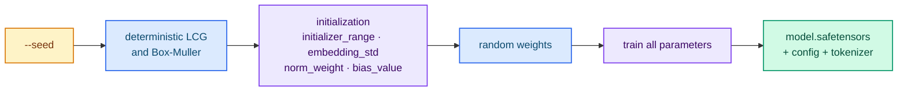

# Training from scratch

`--method from-scratch` initializes **random weights** over an explicit geometry
and trains **all** parameters. Because there is no checkpoint to read the shape or
the tokenizer from, both must be supplied.

## Run it

- the geometry via the flags (`--architecture`, `--vocab-size`, `--hidden-size`,
  `--num-hidden-layers`, `--num-attention-heads`, `--head-dim`, `--rope-theta`, …)
  or the TOML `[model]` section;
- a tokenizer via `--tokenizer-file` (or the TOML `[tokenizer] file` key).

```bash
cargo run --release -p typed-lm-trainer -- train \
  --method from-scratch \
  --architecture qwen2 \
  --vocab-size 151936 \
  --hidden-size 512 \
  --intermediate-size 2048 \
  --num-hidden-layers 8 \
  --num-attention-heads 8 \
  --num-key-value-heads 4 \
  --max-position-embeddings 1024 \
  --tokenizer-file /path/to/tokenizer.json \
  --dataset resources/dataset.jsonl \
  --output-directory output/scratch \
  --seed 42 \
  --epochs 3 --batch-size 4 --learning-rate 1e-4
```

`--model-id` is ignored for `from-scratch`: the geometry flags (or the TOML
`[model]` section) are authoritative, and `from-scratch` is mutually exclusive
with a checkpoint base. Absent geometry keys take the family default (for example
the Gemma2/Gemma3 soft-caps and local RoPE), so the emitted `config.json` is always
serveable.

## Deterministic initialization

Initialization is deterministic and reproducible from `--seed` (default `42`). By
default:

- the projection weights are drawn from a zero-mean normal with standard deviation
  `0.02` (`initializer_range`);
- the embeddings (and an untied `lm_head`) use `embedding_std = 0.02`;
- RMSNorm weights are set to `1.0` (`norm_weight`);
- biases to `0.0` (`bias_value`).

All four are configurable through the TOML `[initialization]` section. The same
`(config, configuration, seed)` triple produces byte-identical tensors.



## Output

The run writes a **complete dense checkpoint** into `--output-directory`:

```text
output/scratch/
├── model.safetensors   # canonical Hugging Face tensor names, all parameters
├── config.json         # reparseable model configuration
└── tokenizer.json      # copy of the tokenizer passed with --tokenizer-file
```

The `model.safetensors` names are the canonical Hugging Face ones the serving
loader reads: `model.embed_tokens.weight`, `model.norm.weight`,
`model.layers.N.input_layernorm.weight`,
`model.layers.N.post_attention_layernorm.weight`,
`model.layers.N.self_attn.{q,k,v,o}_proj.weight`, the Gemma2/Gemma3
`pre_feedforward_layernorm`/`post_feedforward_layernorm` and
`self_attn.{q,k}_norm` weights, the `mlp.{gate,up,down}_proj.weight`, plus
`lm_head.weight` when the embeddings are untied. The `full` method emits the same
names from an existing checkpoint.

Serve it without any further copy or merge step:

```bash
cargo run --release -p typed-lm-serve -- --model-id output/scratch
```

<div class="sk-box sk-box--warning">
<strong>Not a general-purpose assistant.</strong> A from-scratch model is trained only
on the Jev decision objective over your dataset (cross-entropy at the decision
position), not with general causal-LM pretraining. It does <strong>not</strong> acquire
language understanding: it validates the architecture, the dataset and the training
pipeline end to end (and can be served), but it is not a general-purpose assistant.
Use a pretrained checkpoint (<code>lora</code>, <code>qlora</code> or <code>full</code>) for
real routing quality.
</div>

## Next steps

- [Choosing an architecture](./architecture.md) — the geometry flags.
- [Quantization (FP8 and FP4)](./quantization.md) — quantize the artifact.
- [Serving a trained artifact](./serving-artifacts.md) — serve it.
