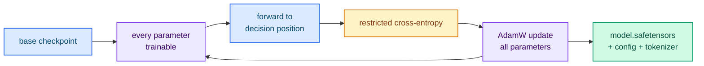

# Full fine-tuning

`--method full` keeps the existing checkpoint weights but makes **every** parameter
trainable: embeddings, norms, all attention and MLP projections, and the
language-model head. It reuses the same forward pass and decision-position loss as
the adapter methods.

## When should I use full fine-tuning?

- You need more capacity than LoRA provides and have a large, clean dataset.
- You can afford the memory: every parameter keeps an F32 master weight plus AdamW
  moments.
- You want a complete, self-contained checkpoint rather than an adapter.

If memory or compute is a constraint, prefer [LoRA or QLoRA](./lora-qlora.md).

## Run it

The geometry is read from the checkpoint `config.json`, so no geometry flags are
required:

```bash
cargo run --release -p typed-lm-trainer -- train \
  --method full \
  --model-id /path/to/local/checkpoint \
  --dataset resources/dataset.jsonl \
  --output-directory output/full \
  --epochs 3 --batch-size 4 --learning-rate 1e-4
```



## Output

```text
output/full/
├── model.safetensors   # canonical Hugging Face tensor names, all parameters
├── config.json         # reparseable model configuration
└── tokenizer.json      # copy of the checkpoint tokenizer
```

This directory is a complete checkpoint. Point `typed-lm-serve` at it with no
merge step.

> **Cost.** Every parameter keeps an F32 master weight plus AdamW moments, so full
> training uses much more memory and compute than LoRA. Use it when the task
> justifies it.

## Next steps

- [Training from scratch](./from-scratch.md) — train from random weights.
- [Quantization (FP8 and FP4)](./quantization.md) — shrink the full checkpoint.
- [Serving a trained artifact](./serving-artifacts.md) — serve it directly.
