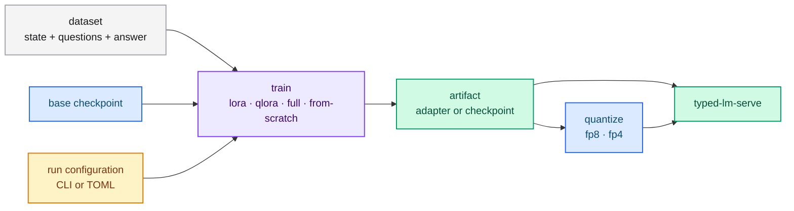
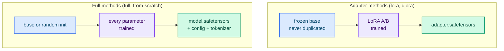

# Training overview

`typed-lm-trainer` is a binary with two subcommands:

- `train` — trains with one of four methods (`lora`, `qlora`, `full`,
  `from-scratch`), either an adapter over a frozen base checkpoint or the full set
  of parameters;
- `quantize` — applies **post-training quantization (PTQ)** to FP8/FP4 and merges
  an optional adapter first.

Both optimize the **cross-entropy at the decision position** — the last prompt
token, restricted to the candidate labels — exactly the position the server reads
at inference. Training therefore tunes the behavior the API actually uses.

## The pipeline



## Training methods

The `--method` flag selects how the model starts and which parameters it trains:

| `--method` | Base origin | Trainable parameters | Output artifacts |
|---|---|---|---|
| `lora` (default) | checkpoint, frozen | LoRA `A`/`B` only | `adapter.safetensors` + `adapter_config.json` |
| `qlora` | checkpoint, quantized (dequantized on load), frozen | LoRA `A`/`B` only | `adapter.safetensors` + `adapter_config.json` |
| `full` | checkpoint | every parameter | `model.safetensors` + `config.json` + `tokenizer.json` |
| `from-scratch` | random initialization | every parameter | `model.safetensors` + `config.json` + `tokenizer.json` |

`lora` and `qlora` are the adapter methods: the base is never duplicated, and only
the adapter tensors are stored. `full` and `from-scratch` train every parameter
and write a **complete dense checkpoint** that `typed-lm-serve` serves directly.



## Prerequisites

- Rust stable.
- A local base checkpoint (the trainer requires a path on disk; Hub identifiers
  must be downloaded first — the server loader can prefetch them).
- Optional: a CUDA build for GPU training.

```bash
cargo build --release -p typed-lm-trainer              # CPU
cargo build --release -p typed-lm-trainer --features cuda   # GPU
```

## Device selection

Every subcommand accepts `--device`:

| Value | Meaning |
|---|---|
| `auto` (default) | CUDA when available, otherwise CPU |
| `cpu` | Force the CPU |
| `cuda` | Force the first CUDA device (fails when no GPU is present) |

Training keeps master weights and optimizer state in **F32** on every device and
uses **BF16** only as the compute dtype on GPU (`PrecisionPolicy`), so adapter
quality is functionally equivalent between CPU and CUDA.

## Where to start

- [Preparing datasets](./datasets.md) — the Jev-native format.
- [Configuring a run](./configuration.md) — CLI flags and the TOML file.
- [Training LoRA and QLoRA adapters](./lora-qlora.md) — the common path.
- [Quantization (FP8 and FP4)](./quantization.md) — shrink the artifact.
