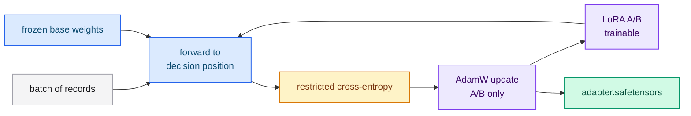

# Training LoRA and QLoRA adapters

LoRA and QLoRA are the adapter methods. They keep the base checkpoint frozen,
train a small set of adapter tensors, and never duplicate the base weights. This
is the recommended path for real routing quality on a pretrained model.

## Train a LoRA adapter

```bash
cargo run --release -p typed-lm-trainer -- train \
  --model-id /path/to/local/checkpoint \
  --dataset resources/dataset.jsonl \
  --output-directory output/train \
  --method lora \
  --lora-rank 16 --lora-alpha 32 \
  --epochs 3 --batch-size 4 --learning-rate 1e-4
```

## Main flags

| Flag | Description | Default |
|---|---|---|
| `--model-id` | Local base checkpoint (directory) | `Qwen/Qwen2.5-1.5B-Instruct` |
| `--dataset` | Dataset file or directory (or `[dataset] path` in the TOML) | required |
| `--output-directory` | Adapter destination | `output/train` |
| `--method` | `lora`, `qlora`, `full` or `from-scratch` | `lora` |
| `--seed` | Initialization seed for `from-scratch` | `42` |
| `--configuration-file` | Optional TOML file; explicit CLI flags win | — |
| `--tokenizer-file` | `tokenizer.json` for `from-scratch` (checkpoint methods read it from the checkpoint) | — |
| `--lora-rank` / `--lora-alpha` | LoRA rank and alpha (scale `alpha/rank`) | `16` / `32` |
| `--lora-dropout` | Adapter dropout | `0` |
| `--epochs` | Epochs | `3` |
| `--batch-size` | Batch per step (items sharing a state are bucketed) | `4` |
| `--gradient-accumulation-steps` | Micro-batches accumulated before a step | `1` |
| `--learning-rate` | Peak LR (warmup + cosine decay) | `1e-4` |
| `--warmup-steps` | Warmup steps | `10` |
| `--weight-decay` | AdamW weight decay | `0` |
| `--maximum-gradient-norm` | Global gradient-norm clipping | `1` |
| `--max-sequence-length` | Maximum prompt length; longer items are skipped | `1024` |
| `--minimum-improvement` | Minimum improvement that resets patience | `0` |
| `--early-stop-patience` | Epochs without improvement before stopping (`0` disables) | `0` |
| `--quantization` | `none`, `fp8` or `fp4` | `none` |
| `--quantization-mode` | `post-training` or `training` | `post-training` |
| `--device` | `auto`, `cpu` or `cuda` | `auto` |



## QLoRA

`--method qlora` trains adapters over a **quantized base** that is dequantized on
load. Use it to fit a larger base in memory:

```bash
cargo run --release -p typed-lm-trainer -- train \
  --model-id /path/to/local/checkpoint \
  --dataset resources/dataset.jsonl \
  --output-directory output/qlora \
  --method qlora --quantization fp4 --quantization-mode training \
  --lora-rank 16 --lora-alpha 32 \
  --epochs 3 --batch-size 4 --learning-rate 1e-4
```

## Adapter output

Written to `--output-directory`:

```text
output/train/
├── adapter.safetensors      # LoRA tensors only (base is never duplicated)
└── adapter_config.json      # rank, alpha, source model, architecture
```

`adapter_config.json`:

```json
{
  "rank": 16,
  "alpha": 32.0,
  "model_identifier": "/path/to/local/checkpoint",
  "architecture": "llama"
}
```

The adapter tensor names are `model.layers.{index}.<projection>.lora_a` and
`.lora_b` for `q_proj`, `k_proj`, `v_proj`, `o_proj`, `gate_proj`, `up_proj` and
`down_proj`. Only the adapter is stored — the frozen base is never copied.

## How do I choose rank and alpha?

- **Rank** controls capacity. `16` is a good default; raise it if the task is hard
  and the dataset is large; lower it for tiny datasets.
- **Alpha** controls the adapter scale (`alpha/rank`). Keeping `alpha = 2 * rank`
  is a common starting point.
- **Dropout** is `0` by default; add a little when overfitting.

## Next steps

- [Quantization (FP8 and FP4)](./quantization.md) — merge and shrink the adapter.
- [Serving a trained artifact](./serving-artifacts.md) — serve the result.
- [Troubleshooting](./troubleshooting.md) — when training misbehaves.
