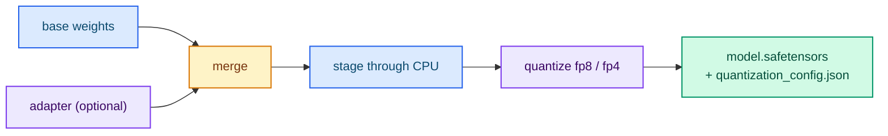

# Quantization (FP8 and FP4)

The `quantize` subcommand applies **post-training quantization (PTQ)** and,
optionally, merges a trained adapter into the base weights first. Both formats are
dequantized to dense F32 on load, because Candle has no matmul kernel for them.

## Run it

```bash
cargo run --release -p typed-lm-trainer -- quantize \
  --model-id /path/to/local/checkpoint \
  --adapter-directory output/train \
  --quantization fp8 \
  --output-directory output/quantized
```

- `--adapter-directory` is optional: when given, the adapter is merged into the
  base weights before quantization; when omitted, the merge is a no-op and the
  base checkpoint is quantized as-is.
- `--model-id` accepts any dense checkpoint directory, including one written by
  `--method full`/`from-scratch`, so a from-scratch artifact can be quantized
  directly.
- Output: `model.safetensors` + `quantization_config.json`.



## Formats

- `fp8` uses `F8_E4M3` tensors with per-channel scaling (`*_scale`).
- `fp4` (MXFP4) writes E2M1 nibbles packed into `U8` plus `F8E8M0` exponents
  (`*_scale`), because safetensors/Candle cannot convert `F4` directly.

Both formats are dequantized to dense F32 on load.

Quantization is a host-side operation: the merged weights are staged through the
CPU (Candle has no CUDA kernel for the FP8 cast) and the artifact is written
CPU-resident.

## Quantized output

Written to `--output-directory`:

```text
output/quantized/
├── model.safetensors         # dense, FP8 or packed FP4 weights (+ metadata)
└── quantization_config.json  # scheme and block size
```

`quantization_config.json`:

```json
{
  "scheme": "fp8",
  "block_size": 32
}
```

Stored tensor layout per scheme:

- `none` — dense `F32` `model.safetensors`, no extra tensors.
- `fp8` — `F8_E4M3` weights, each paired with a per-channel `<weight>_scale`
  tensor.
- `fp4` (MXFP4) — E2M1 nibbles packed into `U8` (`<weight>`), a `U8`
  `<weight>_scale` exponent tensor (F8E8M0) and a `<weight>_shape` tensor
  recording the original shape (the packed tensor is flat).

The `quantize` output holds weights only; copy the base `config.json` and
`tokenizer.json` next to it before serving (see
[Serving a trained artifact](./serving-artifacts.md)).

## Which format should I choose?

| Format | Size | Notes |
|---|---|---|
| `fp8` | ~1 byte per weight | Good accuracy/size balance; per-channel scales |
| `fp4` | ~0.5 byte per weight | Smallest; use when memory is tight |

Both are dequantized on load, so inference reads dense F32 after loading; the
saving is on disk and in transfer.

## Next steps

- [Serving a trained artifact](./serving-artifacts.md) — serve the quantized output.
- [Artifact formats](../reference/artifacts.md) — tensor layouts in detail.
- [Training overview](./index.md) — where quantization fits.
