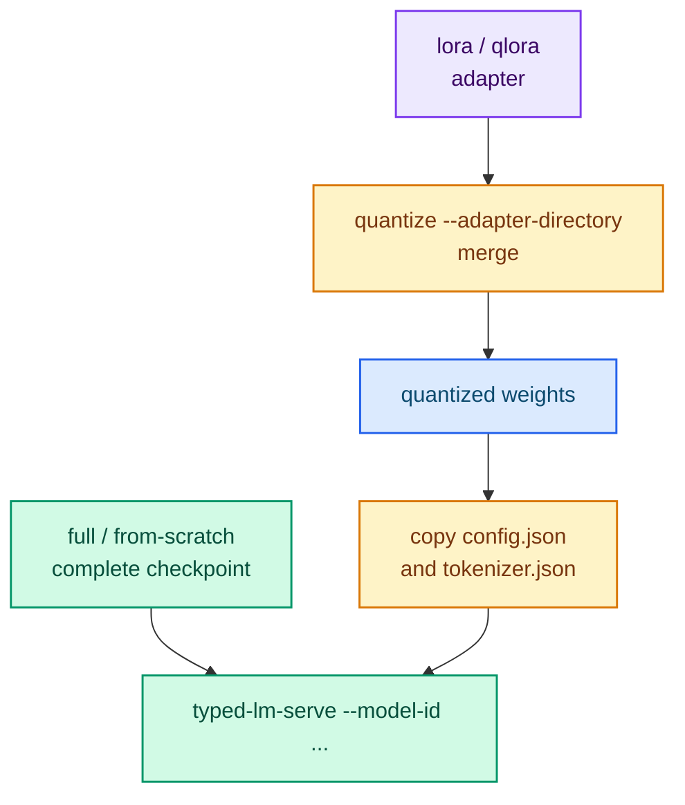

# Serving a trained artifact

What the server can load depends on the training method. The short version:

- `full` and `from-scratch` write a **complete checkpoint** — serve it directly.
- `lora` and `qlora` write an **adapter** — merge it (or quantize it) first.
- `quantize` writes **weights only** — copy the base `config.json` and
  `tokenizer.json` next to them.



## Serve a full or from-scratch checkpoint

A `full` or `from-scratch` artifact is a resolved checkpoint. Point the server at
it:

```bash
cargo run --release -p typed-lm-serve -- --model-id output/full
```

No adapter merge step is required.

## Serve a quantized artifact

The `quantize` output holds only `model.safetensors` and
`quantization_config.json`. Copy the base `config.json` and `tokenizer.json` next
to the weights so the directory resolves as a complete checkpoint:

```bash
cp /path/to/local/checkpoint/config.json    output/quantized/
cp /path/to/local/checkpoint/tokenizer.json output/quantized/

cargo run --release -p typed-lm-serve --features cuda -- \
  --model-id output/quantized \
  --context-path resources/memory.md
```

The server detects the FP8/FP4 artifact and dequantizes it on load.

## Serve a LoRA or QLoRA adapter

An adapter cannot be served on its own. Merge it into the base with the trainer's
`quantize --adapter-directory` (which merges before quantizing), then follow the
quantized-artifact steps above. If you want a dense, unquantized checkpoint,
`quantize --quantization none --adapter-directory <adapter>` performs the merge
without shrinking the weights.

## Verify the served model

```bash
curl -s http://127.0.0.1:8080/v1/models
curl -s http://127.0.0.1:8080/v1/systemone \
  -H 'Content-Type: application/json' \
  -d @examples/request_mixed.json
```

## Next steps

- [Quantization (FP8 and FP4)](./quantization.md) — producing the artifact.
- [Running the server](../guides/running.md) — flags and layouts.
- [Calling the API](../guides/api.md) — the request contract.
